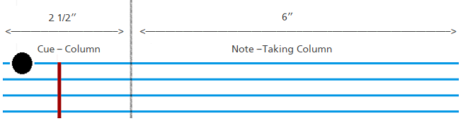
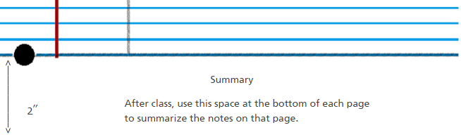

1. **기록(Record)**: 수업 중에, 노트의 오른쪽의 *노트 필기 칼럼(Note-Taking Column)*에 각 수업 내용을 축약한 문장들(telegraphic sentences)을 기록한다.
2. **질문(Questions)**: 수업이 끝날 때마다, 위에서 남긴 노트에 근거해 노트 왼쪽의 *단서어 칼럼(Cue-Column)*에 질문을 작성한다. 각 질문은 의미를 명료화하거나, 관계를 드러내거나, 연속성을 확보하거나, 기억을 강화하는 용도로 쓰인다. 또한 질문을 작성하는 것은 추후 시험 대비를 위한 최적의 환경을 만들어준다.
3. **암송(Recite)**: *노트 필기 칼럼*을 빈 종이로 덮는다. 위에서 남긴 질문이나 단서어(cue-words)가 작성된 왼쪽만을 보고, 단서어가 지시하는 질문, 사실, 아이디어에 대한 답변을 크게 자신의 목소리로 말한다.
4. **회고(Reflect)**: 스스로에게 질문을 던짐으로써 각 주제에 대해 회고한다. 예컨대, "이 사실들이 중요한 이유는 뭐지? (이 사실들은) 어떤 원칙에 근거해 있는 거지? 내가 어떻게 이것들을 적용하지? 내가 이미 알고 있는 것들의 맥락에서 이해할 수 있지? 이 사실들의 바깥에는 무엇이 있지?" 등의 질문을 던질 수 있다.
5. **다시보기(Review)**: 매주 약 10분 정도 과거에 남긴 모든 노트를 다시보는 시간을 가진다. 이러한 행위를 통해 당장의 효용은 물론 시험에 대비해 수업에 대한 기억을 상당 부분 보존할 수 있다.

『How to Study in College 7/e』 by Walter Pauk, 2001 Houghton Mifflin Company에서 인용

---

원문: [The Cornell Note-taking System](http://lsc.cornell.edu/notes.html)

별첨: [코넬 노트 작성법 PDF 다운로드](http://lsc.cornell.edu/wp-content/uploads/2016/10/Cornell-NoteTaking-System.pdf)
