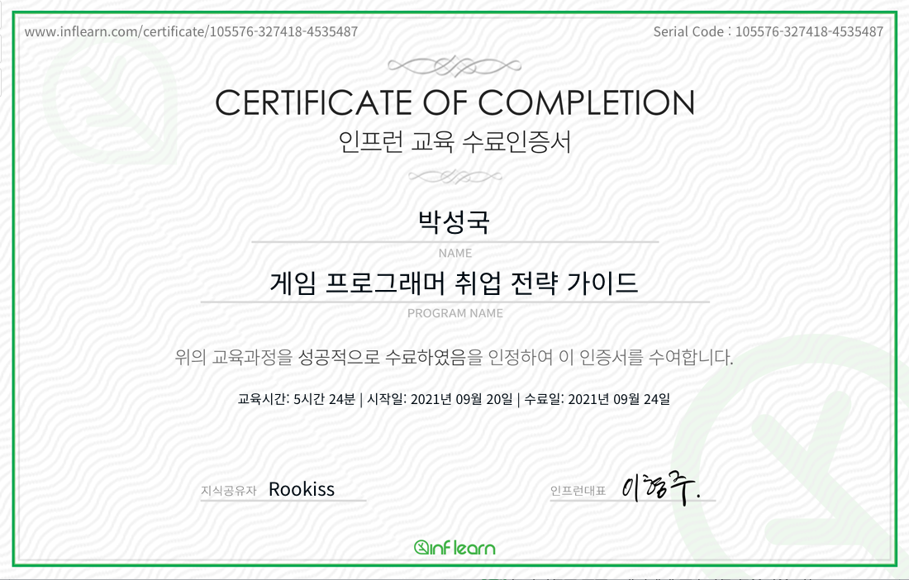

## 강의 평가

게임 프로그래머를 준비하는 학생에게 강력 추천하고 싶은 강의. 내가 비전공자로서 2015년 1월부터 7월까지 국기(국가기간·전략산업직종 훈련) 지원 학원 출신으로 공부했기 때문에 기본기 없이 업계에서 성장하고 생존해야 하는 설움은 누구보다 잘 알고 있다. 스타트업에 신입으로 취업하는 경우의 위험성도 강의 내에서 잘 언급이 되었다. 결국 회사는 노동자의 어떤 것도 보장해주지 않는다. 회사에 들어가서 오래 근무를 한다고 해서 실력이 느는 것도 아니다. 야근을 금기시하고, 일방적인 희생은 피해야 한다. 강사 말대로 **장기적인 목표를 세우고 그 목표에 매진하며 생존의 수단으로서 취업을 대하는 것**이 상책(上策)이다. 프로그래머라고 다 같은 프로그래머가 아니다.

<blockquote class="twitter-tweet">
취업은 최종 목적이 아니다. &quot;필사즉생, 필생즉사(必死則生, 必生則死).&quot; 취업이 목적이라면 어중간한 실력을 갖고 평생 살아가고, 취업이 목적이 아니라면 취업은 스쳐지나가는 인연으로만 치부할 수 있다. 눈앞의 목표에 휘둘리지 않는다. 전체적인 시야를 확보하면 당장의 차이는 다 우스울 뿐이다.
&mdash; Problem Solver (@sungkkshawnpark) <a href="https://twitter.com/sungkkshawnpark/status/1441307848277827586?ref_src=twsrc%5Etfw">September 24, 2021</a></blockquote> 

## 완강 인증

