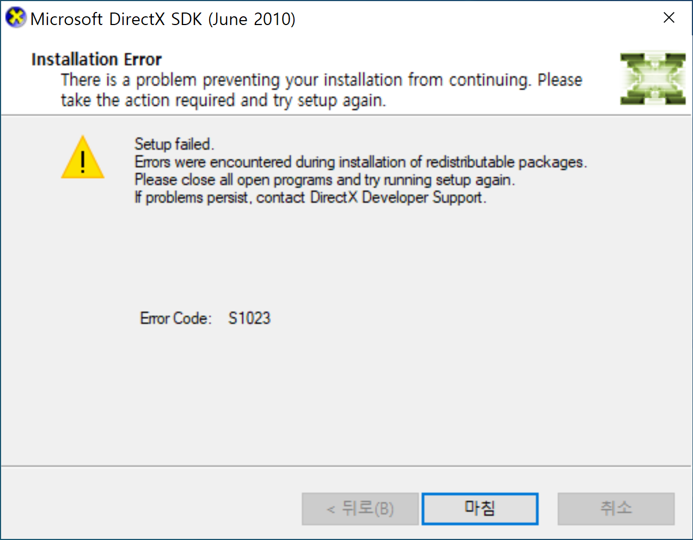
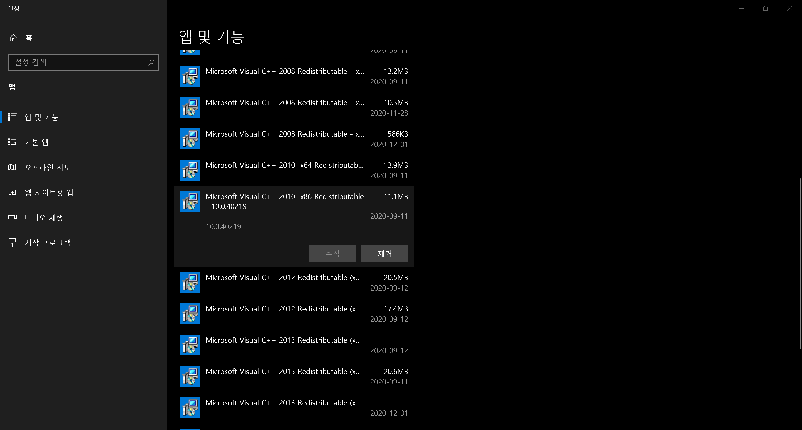
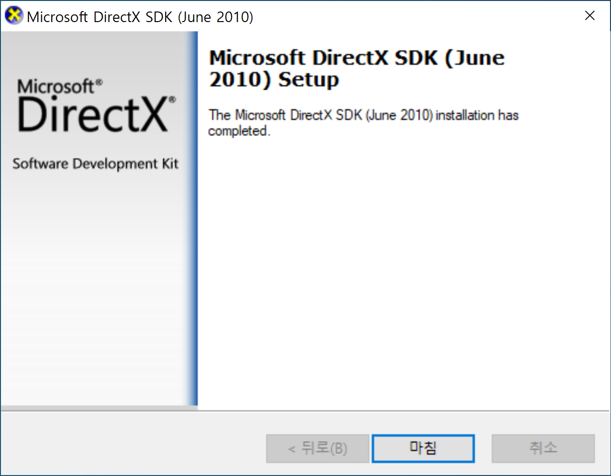

[DirectX SDK]: https://www.microsoft.com/en-us/download/confirmation.aspx?id=6812

[Pope Kim의 셰이더 프로그래밍 입문](https://sungkukpark.github.io/shader_programming_intro_1/)을 학습하기 위한 개발 환경 설정을 하다보면 다음과 같은 에러 메시지와 함께 [DirectX SDK] 설치에 실패하는 경우가 있다:

이는 DirectX SDK에 포함된 Visual Studio C++ 2010 Redistributable 버전보다 높은 버전이 이미 설치되어 있기 때문에 발생하는 문제다. 따라서 해당 문제를 해결하기 위해서는

1. 기존 Visual Studio C++ 2010 Redistributable을 제거하고
1. DirectX SDK를 설치한 뒤
1. 필요에 따라 최신의 Visual Studio C++ 2010 Redistributable을 재설치

하는 방식으로 해결할 수 있다.

### 기존 Visual Studio C++ 2010 Redistributable을 제거

**제어판** > **프로그램 제거** 또는 **프로그램 추가/제거**로 이동해 다음 두 파일을 먼저 제거한다. x86과 x64 두 가지 버전이 존재하기 때문에 둘 다 제거하도록 한다.

### DirectX SDK를 설치

그 다음 DirectX SDK를 설치하면 다음과 같이 끝까지 설치가 성공적으로 완료되는 것을 볼 수 있다.

### 최신 Visual Studio C++ 2010 Redistributable 재설치

이 경우, 우리는 기존에 설치되어있던 Visual Studio C++ 2010 Redistributable보다 더 오래된 버전을 설치한 것이기 때문에 필요에 따라 다음 최신 Microsoft Visual C++ 2010 SP1 Redistributable 패키지를 설치하도록 한다.

- [Microsoft Visual C++ 2010 SP1 Redistributable Package (x86) (3/3/2011)](https://www.microsoft.com/en-us/download/details.aspx?id=8328)
- [Microsoft Visual C++ 2010 SP1 Redistributable Package (x64) (3/3/2011)](https://www.microsoft.com/en-us/download/details.aspx?id=13523)

모든 설치가 끝났으면 DirectX SDK를 필요로 하는 애플리케이션을 실행해 개발을 진행하도록 한다.
