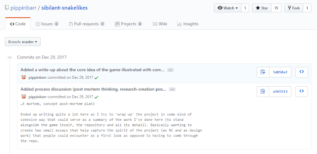

본문은 Dev.olution의 "정원을 가꾸는 일로서의 게임(Games as Gardening)" 회담의 일환으로서 A MAZE Berlin 2019에서 한 내 강연에 근거하고 있디.

정원을 가꾸는 일에 대해서 생각할 때, 나는 볼테르(Voltaire)의 1759년 출간된 소설 『깡디드(Candide)』를 떠올리게 된다. (정말이다. 농담이 아니다. 나는 정말로 그렇다.)

『깡디드』는 "깡디드"라는 이름의 아이가 극도로 고통스러운 비극, 손실, 투쟁의 여정을 거치는 이야기이다. 매순간 그의 멘토인 팡글로스 박사(Dr. Pangloss)는 여전히 그들이 현재 살고 있는 세계가 "가능한 한 최선의 세계"라고 주장한다. 비디오 게임도 크게 다르지 않다. 생활고가 얼마나 극심한지 울부짖는 인디 게임 개발자들이 있는 한편, 그들의 목소리에 귀를 막고 "게임은 실력주의(meritocracy)"라고 주장하는 스팀과 에픽 스토어의 대표자들이 있다.

볼테르는 묻는다, 이 모든 고통을 목도하고도 어찌 모든 것이 괜찮다고 주장할 수 있는가? 책의 말미에서, 깡디드와 그와 함께 겨우 살아남은 몇 친구들은 버려진 농장에서 근근히 연명한다. 그 말도 안 되는 어려움과 고통을 겪은 뒤에도 팡글로스는 여전히 모든 것이 최선의 것으로 판명되었다고 주장하고, 깡디드는 여기에 이렇게 답한다: "그래요, 하지만 우리는 우리의 정원을 가꿔야지요."

많은 독자들이 깡디드의 이 모호한 답변을 실용주의적인(pragmatic) 조언으로서 고개를 숙이고 냉소적인 스토아주의를 구축하고 많은 것들에 대해 너무 심각하게 생각하지 않기를 종용하는 것으로 해석한다. 마치 볼테르가 기후변화, 범세계적 가난, 다시 기승을 부리는 파시즘 같은 불가능한 도전 앞의 엿같은 2019년의 세계에 대해 이러한 문장들을 써내려간 것 같다. 모든 정부, 민간, 종교 단체는 이러한 문제들에 제대로 대처하지 못했다. 미래가 사라진 세계말의 현재에서 모두는 이 모든 것들에 너무 너무 너무 지쳤다. 과연, 닥치고 포기하는 편이 나을 것 같다.

그러나 이는 볼테르가 의미하는 바가 아니다. 결국, 그는 최초의 『백과사전』을 편찬한 말많은 지식인이었고, 모든 (서유럽의) 지식을 분류하려고 시도한 인간이다. 그런 인간이 사회와 분리되라고 말할리는 없다.

정원 가꾸기는 단지 가치있는 노동에 대한 은유일 뿐이다. 이 은유를 게임을 만드는 실천에 적용해보도록 하자.

정원은 정원사, 식물, 땅, 그리고 시간을 필요로 한다. 정원사는 게임 노동자, 식물은 우리가 기르고 살찌우는 비디오 게임이다. 우리는 땅을 성장에 대한 희망을 갖고 경작한다. 정원은 미래에 대한 믿음이며, 과거에 뿌리를 내리고 있다: 이 역사가 누가 땅을 소유하고 경작할지를 결정한다.

## 게임이라는 정원 가꾸기의 역사

애드리언 쇼(Adrienne Shaw)에 의해 주도된 LGBTQ 비디오 게임 아카이브를 예로 들어보자. 동성애혐오와 트랜스혐오 보수주의자들은 LGBTQ들이 게임에 설 자리가 없다고 말한다. 그러나 1989년 출시된 「Caper In The Castro」에서 레즈비언 형사로서 납치된 드랙퀸을 구출하려 한 주인공을 발견한다면 어떨까? 이는 우리들이 현재 갖는 고민이 수십년간 게임에 이미 있었고, 이러한 유산을 발굴해내는 것은 LGBTQ 예술가들의 대표성과 지지의 중요성을 확인하게 해준다.

그러나 이 역사는 또한 매우 취약하다. 만약 C.M. 랄프(Ralph)라는 개발자가 이 게임에 대해 말하지 않고 죽었다면 어떻게 되었을까? 만약 그 누구도 이 게임의 카피를 구하지 못하고, 아무도 이 게임에 대해 기억하지 않으면 어떨까? 우리가 잃은 모든 게이 게임들에 대해 상상해보자. 게임이라는 정원을 가꾸는 일은 우리에게 달려있다. 지금 당장 하지 않으면 이미 너무 늦을 것이다.

그러나 대체 어디에 우리의 역사를 둘 것인가? 그건 바로 "모든 지식에 대한 보편적인 접근을 제공하는" 비영리 온라인 라이브러리인 Archive.org가 바로 그곳이다. Archive.org는 심지어 옛 레트로 게임들을 어떤 웹 브라우저에서도 가동될 수 있도록 에뮬레이팅하는 인터넷 아케이드(Internet Arcade)라는 위대한 계획 역시 가지고 있다.

1970-80년대 게임에 대해 우리가 어떻게 공부하고 기억할 것인가? 이제 우리는 아케이드 게임기에 접근할 필요가 없다. 우리는 에뮬레이터를 다운로드받고 조작할 정도의 기술적인 요령을 갖출 필요가 없다. 여기, 한명의 "정원사"가 옛 ROM을 일구었고, MAME 에뮬레이터를 JS / WASM으로 포팅했으며, 이 과정에서 돋아난 버그들을 고쳤다.

이러한 게임들에 대한 아카이빙, 보존, 유지보수는 노동력을 필요로 한다. 그러나 이에 앞서 첫 단계는 당신이 가진 모든 것이 사라지지 않도록 Archive.org에 업로드하는 일이다.

## 오늘날의 게임이라는 정원 가꾸기

그러나 역사학자들은 자전적인 구술에 대해 의문을 가진다. 그래서 우리가 비디오 게임의 "1차 자료"를 보존하는 것이 가장 중요해진다: 즉, 게임의 소스 코드(source code) 말이다. 게임 연구자들인 릴라 칼리드(Rilla Khaled), 피핀 바(Pippin Barr), 그리고 조나단 레사드(Jonathan Lessard)는 MDMA(마약 종류 말고)를 이론화했다. 이는 미래의 역사학자와 연구자들을 위해 당신의 형상 관리 저장소를 유지하는 최고의 방법들의 집합이다. 그들은 당신의 저장소가 게임 코드와 어셋뿐만이 아니라 게임 디자인 노트, 출판물, 스케치 등을. 당신의 커밋 메시지는 기술적 구현 내역에 대한 것뿐만 아니라 그 이상을 서술해야 하며, 당신의 생각과 의도를 모두 포함해야 한다고 주장한다.

우리가 모든 위대한 소설, 영화, 회화에 대한 형상 관리 저장소를 가지고 있다고 상상해보자. 당신은 시간이 지남에 따라 누적된 예술가들의 결정들을 직접 볼 수 있을 것이고, "헌신의 순간"에 그들의 특정 디자인 결정을 하는 장면을 목격할 수 있을 것이다. 사람들은 당신의 개발 환경을 재구축하고 당신이 내린 선택들을 분석할 수 있을 것이며, 당신의 디자인 결정에 대해 더 잘 이해할 수 있을 것이다. (먼 미래에, 우리는 아마도 더 많은 "정원 다양성"과 함께 사용하기 덜 고통스러운 Git 클라이언트들이 필요할지도 모른다.)

* * *

**그러나 왜**

당신이 당신의 정원을 가꿀 때, 당신은 동시에 자기자신을 가꾸게 된다. 자신을 가꾸는 일의 일부는 당신이 누구인지 기억하는 것이고, 당신이 어디로부터 왔는지 기억하는 것이다. 당신이 누구인지 기억하는 것은 당신의 존엄성을 찾고 당신의 삶을 위해 더 요구할 수 있는 힘을 찾는 일이다. 시간이 지남에 따라, 당신의 다른 정원들은 물론, 범게임적인 집단화와 노조화를 지지하는 게임 노동자 연합(Game Workers Unite)과 같은 시민운동 단체를 지원하게 될 것이다.

정원은 당신이다. 당신이 정원이다. 당신의 뿌리를 잊지 말아라.

* * *

원작자: 로버트 양(Robert Yang) 
원문: [We must cultivate our garden: games as personal history by Robert Yang](https://www.blog.radiator.debacle.us/2019/04/we-must-cultivate-our-garden-games-as.html) 
원문 작성일: 2019년 4월 30일 오후 2시 15분
