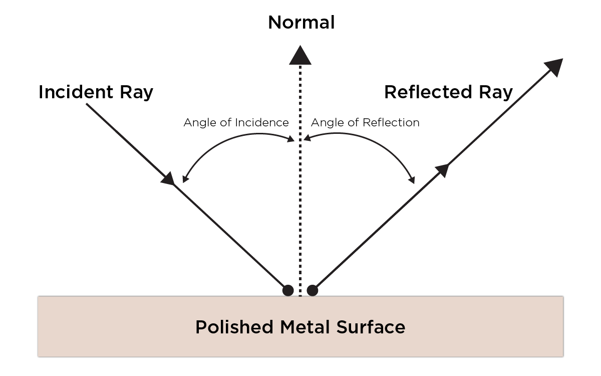
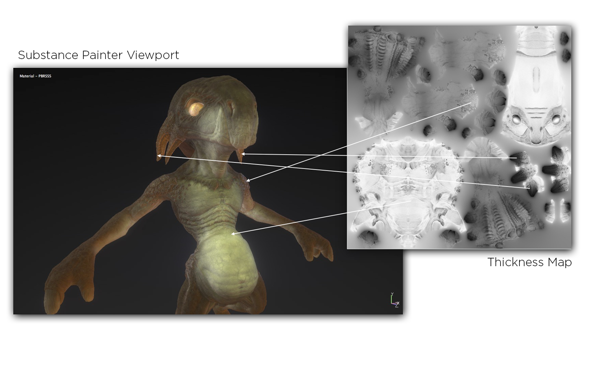
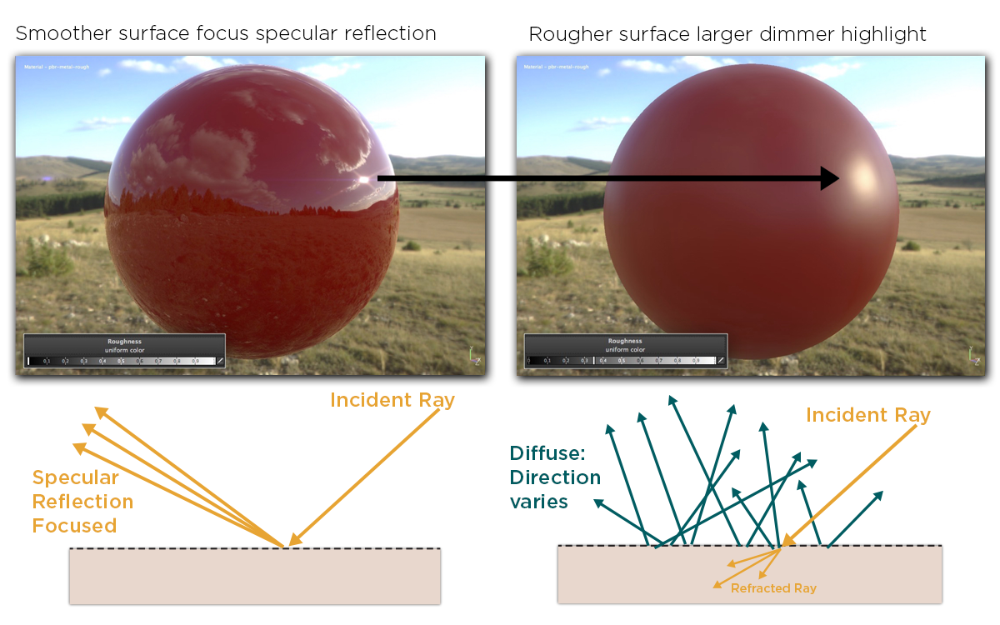
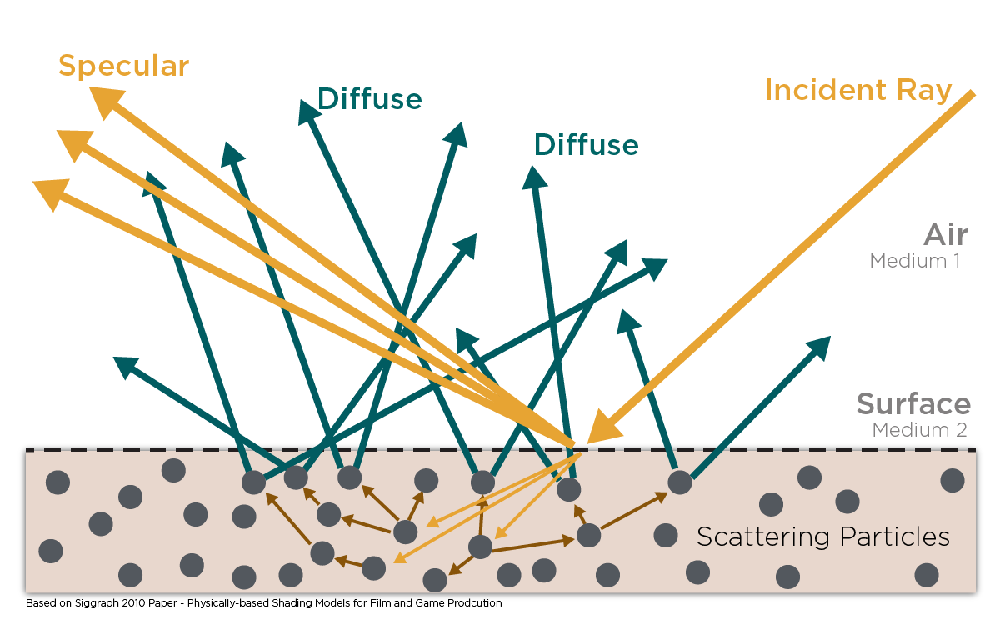
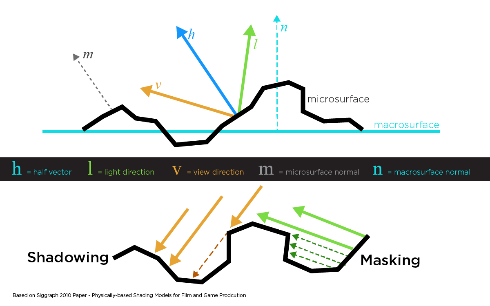
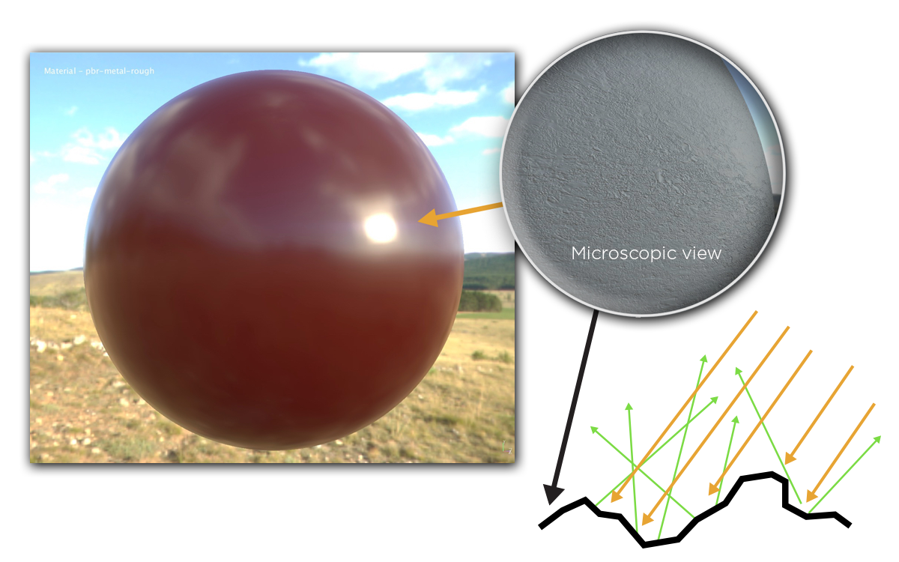
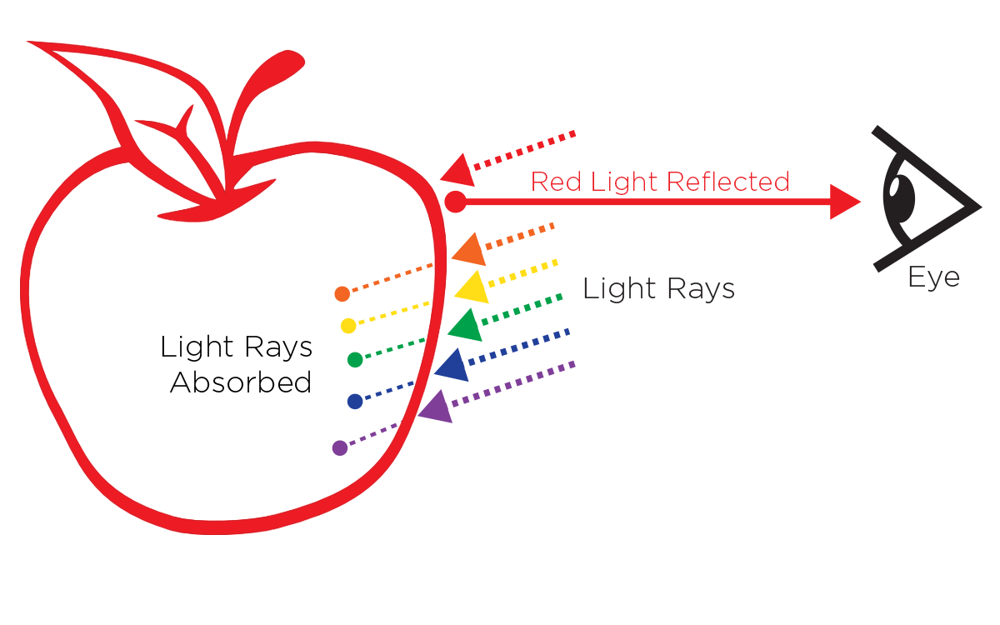
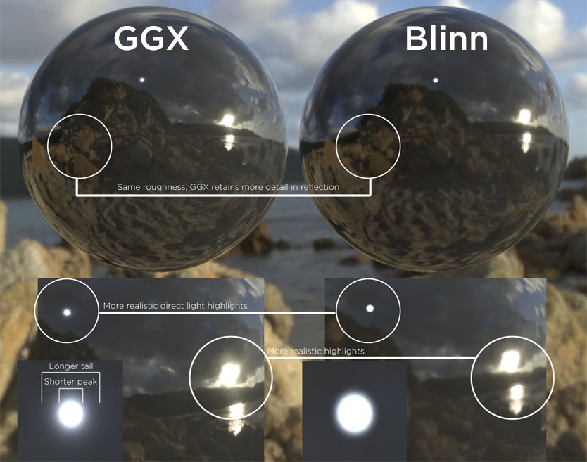
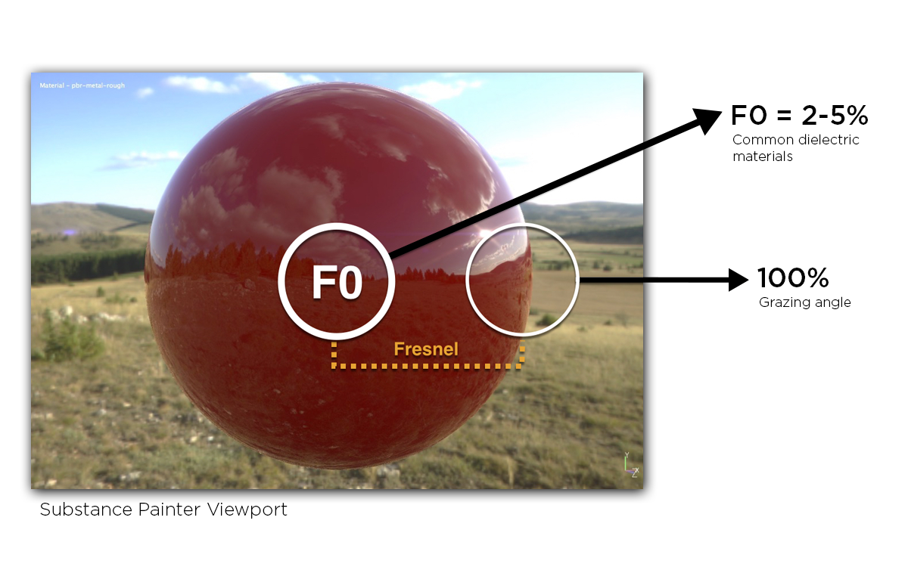

본문은 Allegorithmic사의 물리 기반 렌더링 가이드 - 파트 1 문서를 학습 목적으로 번역한 것이다.

---

## 파트 1. 빛과 물질: 물리 기반 렌더링 이론과 셰이딩 이론

### 목차

- 광선(光線, Light Rays)
- 흡수와 산란 - 투명과 반투명(Transparency and Translucency)
- 난반사와 정반사
- 미세표면(Microfacet) 이론
- 색(色)
- BRDF
- 에너지 보존
- 프레넬(Fresnel) 효과
- F0 (0도에서의 프레넬 반사율)
- 도체와 절연체
- 금속과 비금속
- 선형 공간 렌더링
- PBR의 주요 특징들

## 물리 기반 렌더링 이론과 셰이딩 이론

빛은 파장으로서의 속성과 입자로서의 속성을 동시에 보이는 복잡한 현상이다. 이때문에 빛의 동작을 설명하기 위한 여러 이론 모델들이 등장했다.

텍스처 아티스트의 입장에서는 그중에서도 빛과 물질 사이의 상호작용을 설명하는 광선 모델에 더 관심이 있다. 텍스처 아티스트의 업무는 텍스처를 만들어 표면을 표현하는 것이므로 광선이 어떤 방식으로 표면의 입자와 상호작용하는지 이해하는 것은 중요하다. 우리가 만드는 텍스처와 머테리얼(material)은 가상 세계의 빛과 상호작용한다. 우리가 빛이 어떤 원리로 움직이는지 더 잘 이해할수록 더 높은 품질의 텍스처를 만들 수 있다.

이 가이드에서 우리는 물리 기반 렌더링(PBR)이라는 모델의 배후에 있는 이론에 대해 논할 것이다. 우리는 먼저 광선의 동작을 설명하는 동시에 PBR의 특징들을 정의할 것이다.

### 광선(光線, Light Rays)

빛의 광선 모델은 광선이 공기와 같은 균질하고 투명한 매질에서 직선의 궤도를 가진다고 설명하는 모델이다. 광선 모델은 광선이 불투명한 물체의 표면을 만나거나 공기나 물과 같은 일부 매질을 관통할 떄 예측할 수 있는 방식으로 움직인다고 주장하는 모델이다.

이러한 모델은 광선이 열과 같은 다른 형태의 에너지로 변하는 동안 한 점에서 다른 점으로 향하는 광선의 경로를 시각화하는 것을 가능하게 해준다.

표면과 충돌하는 광선을 입사광(incident ray)라고 부르며 이 광선이 충돌하는 각도를 입사각(the angle of incidence)이라고 부른다 (그림 1 참조).

> 그림 01: 입사각, 입사광과 반사광

평면 위에 입사되는 광선은 두 개의 매질을 연결한다. 광선이 표면과 충돌할 때, 다음 중 하나의 사건이나 두 사건 모두가 발생할 수 있다:

1. 광선이 표면에서 반사되어 다른 방향으로 진행한다. 이는 **반사의 법칙(the Law of Reflection)**을 따르며, 이는 입사각과 반사각이 같다는 법칙이다 → **반사광(reflected light)**.
2. 광선이 한 매질을 통과해 다른 매질로 진행하며 직선의 궤도를 그린다 → **굴절광(refracted light)**.

이 시점에서 광선은 **반사광**과 **굴절광** 두 방향으로 분산된다. 표면에서 광선은 반사되거나 굴절되며 이는 결과적으로 어느 한쪽의 매질에 의해 흡수될 수도 있다. 그러나 흡수는 물질의 표면에서 이뤄지지는 않는다.

### 흡수와 산란 - 투명과 반투명(Transparency and Translucency)

불균질한 매질이나 반투명한 물질을 지나는 경우, 빛은 흡수되거나 산란한다.

빛이 흡수되는 경우, 빛은 열과 같은 다른 에너지의 형태로 변환되면서 그 세기(intensity)가 약해진다. 빛의 색은 파장에 따라 흡수되는 빛의 양에 따라 변하지만 빛의 방향은 변하지 않는다.

빛이 산란할 때, 빛의 방향은 임의로 바뀌며, 이 편차의 양은 물질에 따라 다르다. 산란은 빛의 방향을 임의로 바꾸지만 빛의 세기를 바꾸지는 않는다. 인간의 귀는 이러한 현상의 좋은 예시로 들 수 있다. 인간의 귀는 그 두께가 얇기 때문에 흡수되는 빛의 양이 적다. 때문에 귀 뒤쪽에서 방출되는 산란광(散亂光, scattered light)을 볼 수 있다 (그림 2 참조).

> 그림 02: 귀 뒤쪽에서 방출되는 산란광

산란이 없고 흡수되는 빛의 양이 적으면, 광선은 표면을 관통해 지나친다. 이는 유리와 같은 물질에서 일어나는 현상에 해당한다. 예컨대, 깨끗한 수영장에서 수영을 하는 사람의 경우는 깨끗한 물을 통해 상당한 거리까지 시야를 확보할 수 있다. 그러나 상대적으로 더러운 수영장에서는 먼지 입자가 빛을 산란시켜 물의 투명도를 낮추고 결과적으로 수중에서의 시야를 확보하는 것을 어렵게 만든다.

빛이 매질이나 물질을 더 관통할수록 더 많은 양의 빛이 흡수되거나 산란된다. 따라서 물체의 두께는 빛이 흡수되거나 산란되는 정도에 결정적인 영향을 미친다. 두께 맵(map)의 경우에는 그림 3처럼 셰이더(shader)[^1]에서 물체의 두께를 결정할 수 있다.

> 그림 03: 서브스턴스 페인터의 두께 맵을 통한 표면하산란(Subsurface Scattering, SS) 구현

### 난반사와 정반사

정반사(Specular reflection)는 위에서 광선을 논한 때 언급한 표면에서 반사되는 빛을 일컫는다. 광선은 표면에서 반사되어 각기 다른 방향으로 반사된다. 이는 "완전한" 평면상에서는 반사각이 입사각과 같다는 **반사의 법칙(the Law of Reflection)**을 따른다. 그러나 대부분의 표면은 고르지 못하기 때문에 반사각은 표면의 거칠기(roughness)에 따라 임의로 달라진다. 이 거칠기는 빛의 방향을 바꾸지만 빛의 세기를 바꾸지는 않는다.

거친 표면은 더 큰 면적의 하이라이트(highlight)를 갖게 되며 이는 더 어두워진다(dimmer). 부드러운 표면은 정반사가 집중되게 만들고 이는 특정 각도에서 정반사되는 빛을 더 밝고 강하게 만들어준다. 그러나 이 두 경우에 모두 같은 양의 빛이 반사된다 (그림 4 참고).

> 그림 04: 반사광은 표면의 거칠기에 따라 임의로 달라진다

굴절(Refraction)은 "광선의 방향이 바뀌는 것"을 의미한다. 빛은 하나의 매질에서 다른 매질로 이동할 때 그 속도와 방향이 바뀐다. **굴절률(屈折率, Index Of Refraction, IOR)**은 광학적 측정 단위로서 빛이 진행함에 따라 광선의 방향이 바뀌는 정도를 표현한다. 예컨대, 물의 IOR은 1.33인 반면, 판유리의 IOR은 1.52이다. 그림 5를 보면, 빨대 하나가 물이 담긴 유리로 된 잔에 담겨있는 것을 볼 수 있다. 이 빨대는 빛이 각기 다른 매질(공기, 물, 유리)을 거쳐 진행하면서 굴절됨으로써 휘어져 보인다.

> 그림 05: 빨대가 굴절 때문에 휘어져 보인다

난반사(Diffuse reflection)는 굴절된 빛이다. 예컨대, 한 매질을 통과해 다른 매질로 이동한 광선의 경우 어떤 한 물체에 들어갔다고 치자. 이때, 빛은 물체의 내부에서 수차례 산란하게 된다. 마침내 빛은 굴절되어 해당 물체의 바깥으로 빠져나와 최초에 출발했던 매질의 애초에 들어왔던 지점과 근사한 지점으로 되돌아간다 (그림 6).

> 그림 06: 한 매질에서 다른 매질로 진행하는 광선이 물체의 내부에서 산란되는 모습

난반사하는 물체는 흡수성(吸收性, absorbent)이 있다. 굴절된 빛이 해당 물체에서 너무 오래 체류하게 되면 해당 빛은 물체에 완전히 흡수되어버린다. 만약 빛이 해당 물체를 빠져나오게 되면, 해당 빛은 물체로 들어간 지점으로부터 아주 조금 떨어진 거리만큼 이동할 수 있을 것이다.

따라서, 빛이 들어간 지점과 빠져나오는 지점 사이의 거리는 너무 짧아 무시해도 될 정도다. 전통적인 셰이딩 관점에서의 **렘버트(Lambertian) 모델**은 표면의 거칠기를 염두에 두지 않는다. 그러나 **오렌-네이여(Oren-Nayar) 모델**은 거칠기를 염두고 두고 있다.

높은 산란도와 낮은 흡수도를 가진 물체는 때로는 반투과 매체(participating media)라거나 반투명 물체(translucent materials)로 지칭된다. 이러한 예로서는 연기, 우유, 피부, 옥과 대리석을 들 수 있다. 특히 피부, 옥, 대리석의 경우에는 빛이 들어오는 지점과 빠져나오는 지점 사이의 거리가 더는 무시할 수 없을 정도로 커진 표면하산란(subsurface scattering)을 추가로 구현하는 것으로 해결할 수 있을 것이다. 그러나 변화무쌍하면서 극도로 낮은 산란도와 흡수도를 가진 연기나 안개의 경우에는 몬테 카를로(Monte Carlo) 시뮬레이션과 같은 비싼 방식을 통해 구현될 수 있다.

### 미세표면(Microfacet) 이론

이론상 난반사와 정반사는 광선이 매질과 교차하는 **표면 요철도(irregularities)**에 따라 달라진다. 하지만 실제로는 난반사에 미치는 거칠기의 영향은 빛이 물체 내부에서 산란하는 것에 비하면 그다지 크지 않다. 그 결과로서 빠져나오는 광선의 방향은 표면의 거칠기와 입사각에는 꽤 독립적인 편이다. 이에 따라 난반사에 대한 가장 일반적인 모델인 **렘버트(Lambertian) 모델**은 거칠기를 완전히 무시한다.

본 가이드에서는 **표면 요철도(surface irregularities)**를 표면 거칠기라고 칭하기로 한다. 표면 요철도는 어떤 PBR 워크플로우에서 언급되느냐에 따라 거칠기(roughness), 부드러운 정도(smoothness), 광택도(glossiness) 또는 미세-표면 등의 다른 이름으로 불릴 수 있다. 이러한 모든 용어는 표면의 같은 양상을 기술하기 위해 사용되며 이는 서브-텍셀 지오메트리(sub-texel geometric)의 디테일에 해당한다.

표면 요철도는 어떤 PBR 워크플로우에서 쓰이느냐에 따라 거칠기나 광택도 맵에 의해 구현된다. 물리 기반 BRDF는 **미세표면(microfacet) 이론**에 근거하며 이는 어떤 표면이든 다양한 세부 표면 방향성을 가진 소규모 평면(이를 미세표면이라 부른다)으로 구성된다고 가정하는 이론이다. 각각의 소규모 평면은 법선(normal)에 따라 단일한 방향으로 빛을 반사한다. (그림 7).

> 그림 07: 미세표면(microfacet) 이론에 근거한 물리기반 BRDF

이 미세표면의 법선이 빛의 방향과 보는(view) 방향의 정확히 중간에 해당하는 방향을 바라보는 경우는 가시적인 빛을 반사하게 된다. 그러나 미세표면의 노말(법선)과 하프 노말이 같은 경우에는 그림 8에서 보이는 것처럼 그림자(빛 방향)나 마스킹(보는 방향)에 의해 모든 빛을 반사하지는 못하게 된다.

> 그림 08: 산란 광선에 의한 흐릿한 반사(Blurred reflections)

미세한 관점에서 보면 표면 요철도는 미세한 수준에서 빛의 확산(diffusion)을 발생시킨다. 예컨대, 흐릿한 반사는 산란된 광선에 의해 발생한다. 각 광선은 평행해 반사되지 않으므로 정반사를 흐릿하게 인지하게 된다 (그림 8).

### 색(色)

표면의 가시적인 색상은 광원에서 발산되는 파장에 의해 좌우된다. 이 파장은 물체에 의해 흡수되며 정반사와 난반사 모두를 하게 된다. 여기서 흡수되지 않고 반사된 파장을 색(色, color)이라고 부른다.

예컨대, 사과의 색은 대체로 빨간 빛을 반사한다. 오직 빨간 파장만이 사과 껍질의 바깥으로 산란하며 다른 파장은 흡수된다 (그림 9).

사과는 광원과 같은 색의 밝은 정반사를 하게 된다. 왜냐하면 피부나 사과와 같이 전기를 전도(傳導)하지 않는 물질 - 절연체(絕緣體, dielectrics) - 의 경우 정반사는 파장과 거의 독립적이기 때문이다. 이러한 물질들에서 정반사는 색을 갖지 않는다. 본 가이드에서는 이후에 여러 가지 서로 다른 물질들(금속과 절연체)에 대해 논하게 될 것이다.

서브스턴스 PBR 셰이더는 GGX 미세표면 분포를 사용한다.

> 그림 09: 눈에 반사되는 빨간 파장

### BRDF

**BRDF(양방향 반사 분포 함수, Bidirectional Reflectance Distribution Function)**는 표면의 반사 속성을 표현하는 함수이다. 컴퓨터 그래픽에는 여러가지 BRDF 모델들이 있지만 일부는 물리적으로 타당하지 않다. BRDF가 물리적으로 타당해지기 위해서는 에너지 보존과 전시 상반성(exhibit reciprocity)을 갖춰야 한다. 여기서 상반성(相反性)은 들어오는 빛과 나가는 광선이 BRDF의 결과에 영향을 주지 않으면서 서로 상반된다는 헬름홀츠 상반 원리(Helmholtz Reciprocity Principle)를 말한다.

서브스턴스 PBR 셰이더에서 사용된 BRDF는 디즈니의 원칙에 입각한 반사율 모델(principled reflectance model)에 기반을 두고 있다. 이 모델은 GGX 미세표면 분포에 근거하고 있다. GGX는 정반사 분포에서 더 나은 솔루션 중 하나를 제공하며 이에 따라 더 짧은 하일라이트부와 더 길게 늘어지는 감소부를 가지며 이에 따라 더 사실적으로 보인다 (그림 10).

> 그림 10: GGX vs 블린(Blinn) 정반사 분포 – GGX는 정반사 분포에 관해서는 더 나은 해결책 중 하나를 제공한다

### 에너지 보존

에너지 보존은 물리 기반 렌더링 솔루션에서 핵심적인 역할을 담당한다. 에너지 보존 원리는 표면에서 반사되고 산란되어 다시 발광하는 빛의 총량은 애초에 표면이 받은 빛의 총량보다 적다는 원리이다. 다시 말해, 표면에서 반사되는 빛은 표면과 충돌한 빛의 세기보다 절대로 커질 수 없다는 의미이다. 이때 아티스트 입장에서는 에너지 보존을 통제할 걱정은 할 필요가 없다. 이처럼 에너지 보존이 항상 셰이더에 의해 강제되는 부분은 PBR의 장점 중 하나이다. 이는 물리 기반 모델의 특징 중 하나로서 아티스트들이 물리가 아닌 예술적 표현에 집중할 수 있도록 도와준다.

### 프레넬 효과

프레넬 반사 지수(Fresnel reflection factor)는 물리 기반 셰이딩에서 BRDF의 계수(coefficient)로서 핵심적인 역할을 담당한다. 프레넬 효과는 프랑스의 물리학자인 오귀스탱 장 프레넬(Augustin-Jean Fresnel)에 의해 최초로 관측된 효과로서 표면에서 반사된 빛의 양이 관찰하는 각도에 따라 달라지는 효과이다. 예컨대, 물이 담긴 수영장을 떠올려보자. 관찰자가 물의 표면을 수직으로 바라보면 수영장의 바닥까지 꿰뚫어 볼 수 있다. 이런 각도로 수영장을 보는 것은 0도나 법선 입사(normal incidence)에서 보는 것으로 여기서 법선은 표면의 법선에 해당한다. 관찰자가 스침 입사(grazing incidence)로 물을 바라보면 물의 표면과 평행에 가까워질수록 물의 표면에서의 정반사가 더 강하게 관측되며 물의 바닥은 거의 보이지 않을 것이다.

### F0 (0도에서의 프레넬 반사율)

빛이 수직으로 표면과 충돌하면(0도의 경우) 해당 빛의 특정 퍼센테이지(%)가 정반사된다. 표면의 굴절률(IOR, Index Of Refraction)를 활용하면 여기서 반사되는 빛의 양을 도출할 수 있다. 이를 그림 11에서 보는 것처럼 F0(프레넬 제로)라고 부른다. 이때, 표면에서 굴절되는 빛의 양을 1-F0라고 부른다.

> 그림 11: 매끄러운 유전체(誘電體)의 표면에서 F0는 2-5%의 빛을 반사하고 비스듬한 각도에서는 100%를 반사한다

F0는 대부분의 유전체(誘電體)에서 0.02-0.05(선형 값)이다. 도체(導體, conductors)의 경우에 F0는 0.5-1.0이다. 따라서 표면의 반사성은 다음 공식의 굴절률에 의해 결정된다 (Lagarde 2011).

F0 반사율은 

It is the F0 reflectance value that we are concerned with in regards to authoring our textures. Non-metals (dielectrics/insulators) will have a greyscale value and metals (conductors) will have an RGB value. With regards to PBR and from an artistic interpretation of reflectance, we can state that for a common smooth dielectric surface, F0 will reflect between 2% and 5% of light and 100% at grazing angles as was shown in Figure 11.

The dielectric (non-metal) reflectance values don't actually change very drastically. In fact, when altered by roughness the actual changes in value can be hard to see. However, there is a difference in the values. In Figure 12, you can see a chart that shows the F0 ranges for both metal and non-metal materials.

Notice that the ranges for non-metals do not deviate from each other drastically. Gemstones are an exception as they have higher values. We will discuss F0 as it specifically relates to conductors and insulators a bit later.

### 도체와 절연체

Conductors and Insulators (Metals and Non-Metals)

When creating materials for PBR, it is helpful to think in terms of metal or non-metal. Ask yourself if the surface is metal or not. If it is, you will need to follow one set of guidelines. If it is not, you will need to follow another.

This can be a simplistic approach as some materials may not fall into these categories such as metalloids (a mix of metal and non-metal), but in the overall process of creating materials, distinguishing between metal and non-metal is a good approach and metalloids are an exception. To set up guidelines for materials, we must first understand what we are trying to create. With PBR, we can look at the properties of metals (conductors) and non-metals (insulators) to derive this set of guidelines as shown in Figure 12.

> Figure 12: F0 ranges for both metal and non-metal materials

Refracted light is absorbed, and the color tint of metals comes from the reflected light, so in our maps, we don’t give metals a diffuse color.

### 금속

> 작성 중

## 원문

- [The PBR Guide - Part 1](https://academy.substance3d.com/courses/the-pbr-guide-part-1)

[^1]: 여기서 셰이더(shader)란 "픽셀의 위치와 색을 결정하는 함수"를 의미한다.
