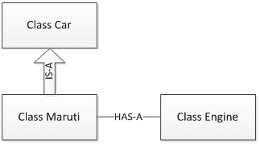
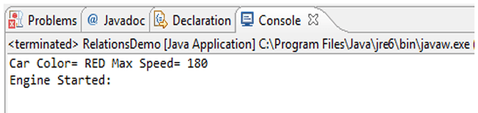

원문: [Inheritance (IS-A) vs. Composition (HAS-A) Relationship - w3resource](https://www.w3resource.com/java-tutorial/inheritance-composition-relationship.php)

---

OOP 언어 사용 시의 장점 중 하나는 코드 재사용성이다. 코드를 재사용하는 방법으로는 2가지 방법이 있다. 하나는 상속의 구현 (IS-A 관계)이고 다른 하나는 객체 구성 (HAS-A 관계)이다. 컴파일러나 자바 가상 머신 (JVM)은 개발자가 상속을 사용할 때 그 배후에서 많은 작업을 해주지만, 구성을 사용해서도 상속이 제공하는 이점을 취할 수 있다.

## IS-A 관계

OOP에서 IS-A 개념은 전적으로 상속, 특히 클래스 상속과 인터페이스 상속이라는 2가지 종류의 상속에 기반한다. 이는 "A는 B 타입의 무엇이다."라는 문장으로 표현될 수 있다. 예컨대, "사과는 과일이다"라는 문장이나 "자동차는 탈 것"이다 따위의 문장을 예로 들 수 있다. 상속은 단방향적이다(uni-directional). 예컨대, "집은 건물이다"라는 문장은 참으로 성립하지만 "건물은 집이다"라는 문장은 참으로 성립할 수 없다.

IS-A 관계를 파악하는 것은 쉽다. extends 키워드나 implements 키워드가 클래스 선언부에서 쓰였다면 이는 IS-A 관계라고 말할 수 있다.

# HAS-A 관계

구성(HAS-A)은 단순하게 다른 객체들을 가리키는 인스턴스 변수들의 사용을 의미한다. 예컨대, 이는 "마루티(Maruti)는 엔진을 가지고 있다" 또는 "집은 화장실을 가지고 있다" 등의 문장으로 표현할 수 있다.

이러한 개념들을 자동차 클래스 예제로 알아보도록 하자.



```java
package relationships;
class Car {
	// 메소드 구현과 클래스/인스턴스 멤버
	private String color;
	private int maxSpeed;
	public void carInfo(){
		System.out.println("Car Color= "+color + " Max Speed= " + maxSpeed);
	}
	public void setColor(String color) {
		this.color = color;
	}
	public void setMaxSpeed(int maxSpeed) {
		this.maxSpeed = maxSpeed;
	}
}
```

위에서 보는 것처럼, 자동차는 인스턴스 변수와 메서드를 가지고 있다. 마루티는 특정 종류의 자동차로서 Car 클래스를 확장하고 있기 때문에 마루티와 자동차는 "마루티 IS-A 자동차"라는 IS-A 관계라고 할 수 있다.

아래의 RelationsDemo 클래스는 마루티 클래스를 생성한 뒤 초기화하고 있다. 마루티 클래스는 setColor(), setMaxSpeed(), 또는 carInfo() 메서드를 가지고 있는 것이 아님에도 불구하고 우리는 이 메서드들을 사용할 수 있는데 이는 마루티 클래스와 자동차 클래스가 가지는 IS-A 관계 때문에 가능한 것이다.

```java
package relationships;
public class RelationsDemo {
	public static void main(String[] args) {		
		Maruti myMaruti = new Maruti();
		myMaruti.setColor("RED");
		myMaruti.setMaxSpeed(180);
		myMaruti.carInfo();
		myMaruti.MarutiStartDemo();
	}
}
```

위의 RelationsDemo 클래스 예제를 실행하면 다음과 같은 출력을 볼 수 있다.



## 상속 vs. 구현의 비교

- 상속보다는 구성이 클래스 변경에 용이하다. 상속 계층 상에서의 부모 클래스 변경은 자식 클래스에 영향을 줄 수 있기 떄문이다.
- 상속에 있어서는 자식 클래스가 부모 클래스가 가진 것과 같은 이름의 시그니처(signature)를 가진 메서드를 추가할 수는 없지만 다른 반환값을 가진 메서드는 추가할 수 있다. 하지만 구성은 백엔드(back-end) 클래스에 영향을 주지 않으면서 프론트엔드(front-end) 클래스의 인터페이스를 변경할 수 있다.
- 구성은 동적 바인딩(dynamic binding/run-time binding)인 반면에 상속은 정적 바인딩(static binding/compile time binding)이다
- 상속에 있어 새 자식 클래스를 추가하는 것은 구성에서 새 프론트엔드 클래스를 추가하는 것보다 더 쉽다. 이는 상속은 다형성과 함께 쓰이기 때문이다. 부모 클래스 상속에 의존하고 있는 코드가 있다면, 별도의 변경 없이 새로운 자식 클래스와 함께 쓰일 수 있다. 하지만 이는 인터페이스를 통한 구성을 쓰지 않는 한, 모든 구성에 해당하는 얘기는 아니다. 이처럼 구성과 인터페이스를 동시에 사용하는 것은 매우 강력한 디자인 도구가 될 수 있다.
- 구성과 상속 모두에 있어, 어떤 클래스에서든지 구현의 변경 (인터페이스의 변경이 아니라) 자체는 쉽다. 구현 변경으로 인한 파장은 같은 클래스 안에서 머무르기 때문에 그렇다.
- 코드를 사용하기 위한 용도만으로 상속을 사용하지 마라. 코드를 재사용해야 하는데 꼭 IS-A 관계를 써야 하는 것이 아니라면 구성을 써라.
- 다형성(Polymorphism)을 얻기 위한 용도만으로 상속을 사용하지 마라. 다형성을 꼭 지원하고 싶다고 해서 반드시 IS-A 관계를 채택해야 할 이유는 없다. 대신 인터페이스를 통한 구성을 써라.

## 요약

- IS-A 관계는 상속에 기반한다. 이 상속은 크게 2가지로 나뉘는데 클래스 상속과 인터페이스 상속이 바로 그것이다.
- HAS-A 관계는 구성 관계로서 코드 재사용에 있어 생산적인 수단이 될 수 있다.
