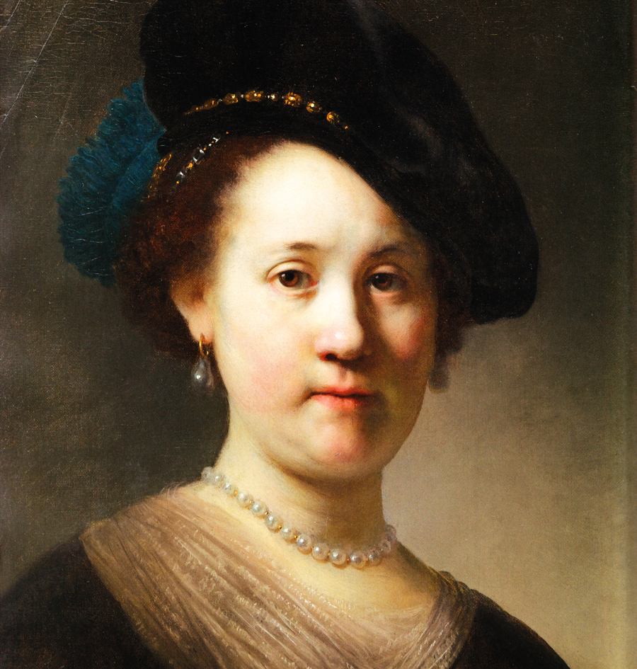
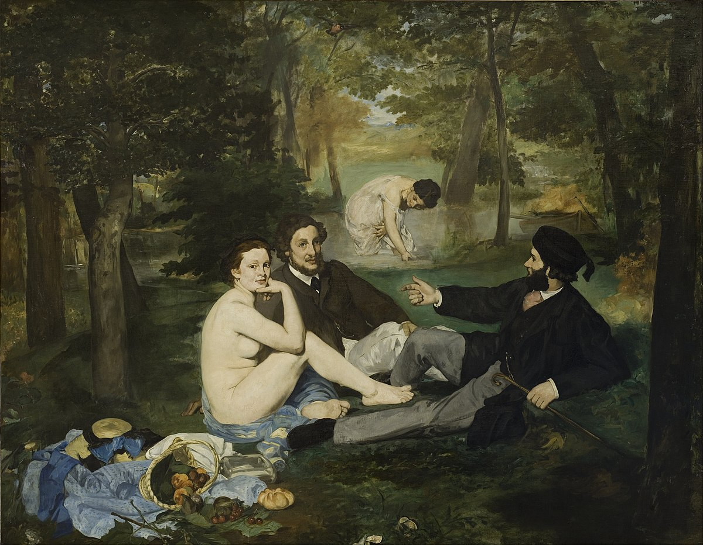
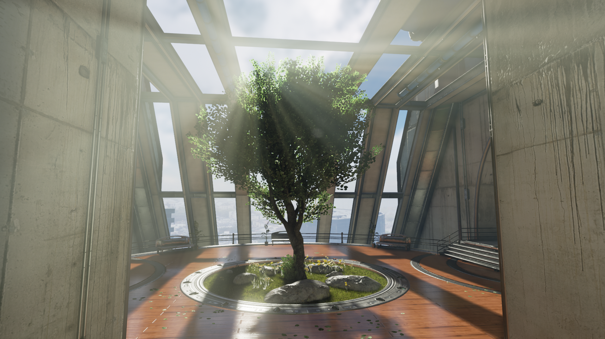
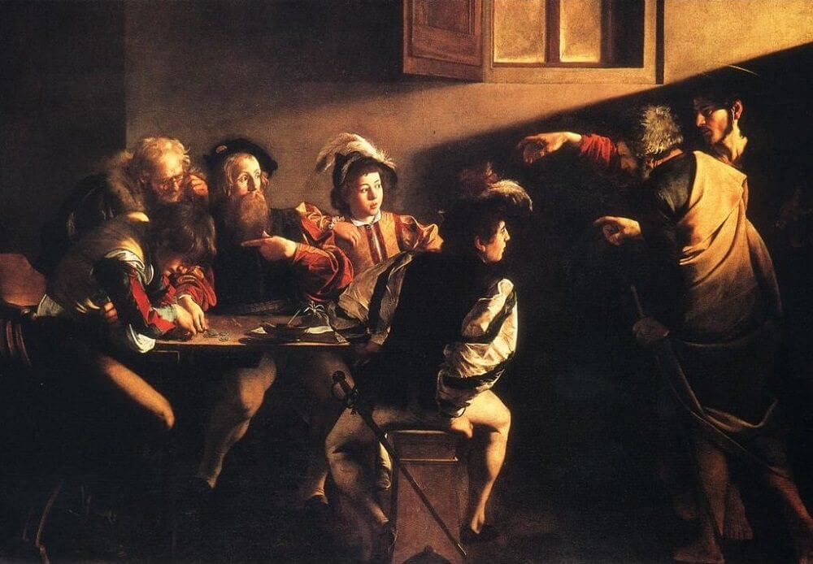
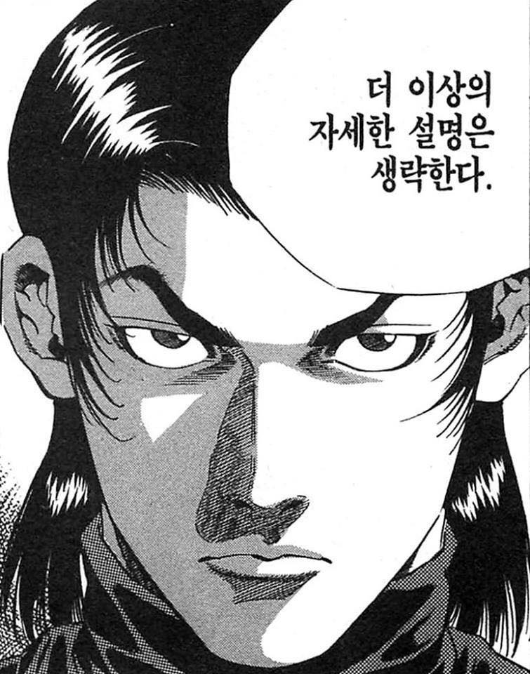

[라이팅(Lighting)을 통한 비주얼 스토리텔링과 Next Gen 게임 라이팅 테크닉]: https://youtu.be/zcMcAmfHWMo

본문은 라이팅 아티스트 이호성(이호야)님의 「[라이팅(Lighting)을 통한 비주얼 스토리텔링과 Next Gen 게임 라이팅 테크닉]」 강연을 시청하고 요약한 내용이다.

---

# 목차

Part 1. 라이팅(Lighting)이란?

1-1. 라이팅의 정의와 목적 
1-2. 라이팅 기본 용어와 기본 컨셉

Part 2. 라이팅을 통한 비주얼 스토리텔링

2.1. 비주얼 스토리텔링이란? 
2.2. 「디 오더: 1886」 게임 적용 사례

Part 3. 라이팅 잘하는 꿀팁

---

# Part 1. 라이팅(Lighting)이란?

라이팅은 어렵지 않다. 라이팅의 기본 원리를 알면 라이팅은 매우 쉽다.

## 1-1. 라이팅의 정의와 목적

### 라이팅의 정의

라이팅(Lighting)이란 "[의식과 의도를 가지고 라이트를 이용해 실용적이거나 미적인 효과를 만들어내는 작업](https://en.wikipedia.org/wiki/Lighting)"이다.

「디 오더: 1886」은 시네마틱 경험(Cinematic experience), 즉, 영화같은 게임플레이를 위해 "좋은(good)" 라이팅이 필요했다.

### 좋은 라이팅(good lighting)이란?

라이팅은 사과와 같은 물체 하나를 가지고 연출을 하더라도 수없이 많은 결과물이 나올 수 있기 때문에 특정 라이팅이 좋은(good) 라이팅이라고 말하기 어렵다. 하지만 좋은 라이팅이 어떤 효과를 주는지는 살펴볼 수 있다.

### 좋은 라이팅의 목적

1. 라이팅을 통해 다양한 무드(mood)와 톤(tone)을 표현한다
2. 오브젝트의 형태(shape) 표현을 좋게 만든다
3. 캐릭터와 배경을 분리한다
4. 깊이(depth)를 표현한다
5. 질감(texture)을 표현한다

### 1. 다양한 무드와 톤의 표현

- Color 컨트롤과 Color 밸런스를 통해 라이팅에서 다양한 무드와 톤을 표현할 수 있다.
- 예컨대, 특정 컬러 팔레트(palette)를 두고 해당 컬러 팔레트를 표현해내는 라이팅 씬을 잡을 수 있다.
- 팁을 하나 주자면, 라이팅 작업 시에는 반사가 잘 이뤄지지 않는 어두운 곳에서 작업을 해야 반사의 영향을 받지 않고 더 정확한 라이팅 작업을 수행할 수 있다.

### 2. 오브젝트의 형태(shape) 표현

- 카메라가 바라보는 방향(view angle)으로 라이팅을 비추면 오브젝트의 형태가 밋밋해진다. 이를 플랫 라이팅(flat lighting)이라고 한다.
- 기본 구(sphere) 오브젝트를 생성한 다음 플랫 라이팅을 가하면 원인지 구인지 판단하기도 어렵고 배경의 색도 분간하기 어렵다.
- 그러나 라이팅의 방향을 바꾸는 것만으로도 구의 형태를 표현할 수 있고 깊이(depth)까지 표현할 수 있다. 게다가 이 과정에서 배경의 색도 표현이 된다.

### 3. 캐릭터와 배경의 분리

- 배경을 아주 밝게 하거나 아주 어둡게 하여 캐릭터를 분리한다.
- 예컨대, 영화 「더 그레이(The Grey)」를 보면 캐릭터가 배경보다 어둡거나 밝은 식으로 배경과 분리되어 부각되는 것을 발견할 수 있다.

### 4. 깊이(depth)의 표현

- TV나 모니터 표준 디스플레이는 사실 평면 2D에 불과하다.
- 이런 2D 미디어에서 입체감을 표현하는 일이 라이팅의 가장 중요한 일 중 하나이다.
- 예컨대, 실사 사진이라고 해도 앞서 언급한 플랫 라이팅을 사용하면 밋밋하게 보이는 반면, 그림이라고 해도 렘브란트(Rembrandt)의 작품처럼 입체적인 라이팅을 사용하면 더 현실적인 공간감을 줄 수 있다

> 「검은 모자를 쓴 젊은 여인의 초상」, 렘브란트, 1632년

- 깊이를 표현할 때는 오브젝트의 깊이 표현뿐만 아니라 전경(foreground), 중경(midground), 배경(background)의 깊이도 표현할 수 있어야 한다.

> 「풀밭 위의 점심 식사」, 에두아르 마네(Édouard Manet), 1862-1863년

### 5. 질감의 표현

- 질감 표현에서 **가장 위험한 것**은 플랫 라이팅(flat lighting). 측광(side light)는 질감을 살리는데 좋다. 모델링에서 추가한 디테일들이 라이팅이 적용할 때 눈에 잘 보이지 않는다면 그것은 라이팅 문제일 가능성이 높다.
- 질감은 빛이 아니라 그림자에서 온다. 따라서 질감 표현에 있어서는 밝은 부분보다는 어두운 부분에 초점을 맞춰야 한다. 질감은 하드 라이트(Hard Light)로 잘 표현된다. 하드 라이트에서는 그림자(shadow)가 날카롭기 때문이다(sharp).

## 1-2. 라이팅 기본 용어와 기본 컨셉

### 3 포인트 라이팅

1. 주광(主光, Key Light): 물체의 모습을 밝게 비추는 라이트
2. 보조광(補助光, Fill Light): 어두운 부분을 채워주는 라이트
3. 후광(後光, Back Light): 캐릭터와 배경을 분리하는 라이트

### 로우 키 라이팅 Vs. 하이 키 라이팅

#### 로우 키(Low-Key) 라이팅

- 로우 키(Low-Key) 라이팅은 주광과 보조광의 비율, 즉, 조명비(lighting ratio)가 높아 밝은 영역과 어두운 영역의 대비(contrast)가 높은 라이팅을 일컫는다
- 드라마틱한 분위기를 연출할 때
- 캐릭터에 강렬한 인상 표현을 주고 싶을 때
- 남성미를 강조하고 싶을 때
- 키아로스쿠로(Chiaroscuro)[^1] 효과를 표현하고 싶을 때

#### 하이 키(High-Key) 라이팅

- 하이 키(High-Key) 라이팅은 조명비가 낮아 밝은 영역과 어두운 영역의 대비(contrast)가 낮은 라이팅을 일컫는다
- 밝고 명랑한 분위기를 연출할 때

#### 하드 라이트(Hard Light)

광원(lighting source)의 크기가 작을 때 이를 하드 라이트(Hard Light)라고 한다. 그림자가 날카롭게(sharp) 떨어진다

- 조명의 크기가 작다
- 선명한 그림자
- 텍스처의 디테일을 표현하기에 좋다
- 태양빛이 좋은 예
- 잔디의 질감을 표현할 때 주로 쓴다
- 강인한 남성미를 표현

#### 소프트 라이트(Soft Light)

광원의 크기가 클 때 이를 소프트 라이트(Soft Light)라고 한다. 그림자가 부드럽게 떨어진다

- 조명의 크기가 큼
- 부드러운 그림자
- [**꿀팁**] 주름이나 잡티 같은 텍스처의 디테일을 숨기기 좋다
- 창문의 라이트가 좋은 예
- 부드러운 여성 캐릭터를 표현

#### 라이트 샤프트(Light Shaft)

- 라이트 빔(beam)을 표현하기 위해 3D의 볼류메트릭 라이팅(Volumetric lighting) 효과를 사용
- 배경과 캐릭터를 분리하거나 깊이(depth) 표현을 위해서도 쓰인다

[^2]

#### 키아로스쿠로(Chiaroscuro) 효과

- 키아로스쿠로(Chiaroscuro)란 빛과 어둠에서 오는 강한 대조를 사용하는 기법
- "키아로(Chiaro)"는 이탈리아어로 빛이라는 뜻이다
- "스쿠로(Scuro)"는 이탈리아어로 어둠이라는 뜻이다
- 빛이 좌상단에서 온다고 할 때, 어둠-빛-어둠-빛이 교차되며 물체가 배경에서 분리되게 된다
- 렘브란트는 키아로스쿠로 효과를 가장 잘 표현한 화가이다
- 렘브란트의 라이팅 기법을 일컬어 "렘브란트 라이팅(Rembrandt lighting)"이라고 한다
- 이는 라이팅을 이용해 대비(contrast)를 극대화하고 캐릭터와 배경을 효율적으로 분리시키는 라이팅 기법이다

# Part 2. 라이팅을 통한 비주얼 스토리텔링

## 2.1. 비주얼 스토리텔링이란?

- 이미지 속에 숨겨져 있는 의미가 스토리텔링에 가장 강력한 도구(tool)다
- 라이팅은 스토리텔링의 키 요소(key factor)이다
- 라이팅을 통한 비주얼 스토리텔링은 사람들의 마음 속 깊은 감정선까지 미치는 강력한 힘이 있다

#### 거장의 스토리텔링

> 「성 마태의 소명」, 카라바조(Michelangelo Merisi da Caravaggio), 1599-1600년

- 옛날 화가는 그림 한 장에 모든 스토리를 넣어야 했기에 그림 속에 많은 암시적 표현을 씀
- 빛은 지식, 성스러움을 암시
- 어둠은 무지, 악을 암시
- 라이팅 아티스트는 거장과 닮기 위해 이러한 과거 라이팅의 활용을 적극적으로 연구해야 한다

#### 스토리텔링과 라이팅의 연속성(Consistency)

- 「반지의 제왕」에서 프로도가 나즈굴들에게 쫓기는 장면에서 카메라의 각도가 바뀌는 와중에 광원의 위치도 매번 변함. 즉, 라이팅에 있어 연속성(Consistency)이 결여되어 있음
- 이처럼 스토리텔링과 분위기 전달을 위해서는 라이팅의 연속성과 이에 대한 논리적 해석은 중요하지 않다

## 2.2. 「디 오더: 1886」 게임 적용 사례

- 자세한 내용은 생략한다. 구체적인 「디 오더: 1886」 라이팅 분석은 [본 영상](https://youtu.be/zcMcAmfHWMo?t=1530)을 참고할 것

# Part 3. 라이팅 잘하는 꿀팁

1. **카메라/사진 배우기**: 카메라/사진을 배우지 않고는 전문적인 지식을 가진 라이팅 아티스트들과의 대화가 성립하지 않는다. 제한된 시간 내에 카메라/사진의 기초부터 알려줄 수는 없는 노릇이기 때문이다. 카메라를 배울 때는 수동(manual) 조작 방식으로 제어할 수 있는 카메라를 사용하도록 한다
2. **고전 회화(classic painting) 공부하기**: 이미 오래 전의 렘브란트, 카르바조 등 고전 회화의 대가들이 빛의 활용의 테크닉을 집대성해놓았다. 대가들의 작품을 기계적으로 베끼지 말고 빛을 어떻게 활용했는지 주의깊게 분석하고 그 전문성을 추출(extract)하라

[^1]: 빛과 어둠의 강렬한 대비를 통해 전체 구도에 영향을 주는 기법이다. 이는 미술가와 미술사학자들에 의해 사용된 기술적인 용어로서 3D 물체와 형상의 모델링에서의 양감(volume) 표현을 목적으로 한 빛의 대비 활용에 해당한다.
[^2]: [Light Shafts | Unreal Engine Documentation](https://docs.unrealengine.com/en-US/BuildingWorlds/LightingAndShadows/LightShafts/index.html)
