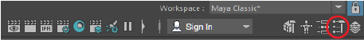

본문은 내가 가장 자주 사용하는 Maya 필수 단축키를 정리한 문서이다.

---

### D

Edit Pivot. **피벗(Pivot)의 위치를 변경하는 모드를 활성화한다**. Tool Settings > Edit Pivot을 선택하는 식으로도 사용할 수 있다.

---

### G

Last Tool Used. **마지막으로 사용한 도구를 불러와 사용한다**. "마지막으로 사용한 도구"에는 선택(Select), 이동(Move), 회전(Rotate), 늘이기(Scale) 도구는 포함되지 않는다.

---

### F

Frame Selection. **현재 포커싱된 뷰에 선택한 오브젝트들이 가득 차도록 프레임을 맞춘다 맞춘다**. 단축키를 사용하는 대신 View 패널에서 View > Frame Selection 메뉴를 선택하는 식으로도 사용할 수 있다.

---

### F7

Center Pivot. **피벗(pivot)을 자동으로 계산된 물체의 무게중심점으로 이동시킨다**. 상단 메뉴의 Modify > Center Pivot 메뉴를 선택하는 식으로도 사용할 수 있다.

### Alt + B

**뷰 패널(view panel)의 배경색을 바꾼다.** Windows > Settings/Preferences > Color Settings로 들어가 배경색이나 그라디언트(gradient)를 조정할 수도 있다.

---

### Shift + F

Frame Selected in All Views. **모든 뷰에 선택한 오브젝트들이 가득 차도록 프레임을 맞춘다**. 단축키를 사용하는 대신 메인 메뉴에서 Display > Frame Selected in All Views를 선택하는 식으로도 사용할 수도 있다.

---

### Alt + Shift + D

Delete History. **현재까지 기록된 작업 히스토리 지운다.** Edit > Delete by Type > History를 선택하는 식으로도 사용할 수 있다.

---

### Ctrl + G

Group. **Outliner에서 현재 선택된 오브젝트들을 하나의 그룹으로 묶는다**. Edit > Group을 선택하는 식으로도 사용할 수 있다.

---

### Shift + P

Unparent. **Outliner에서 현재 선택된 자식들을 부모 그룹에서 제거한다**. Edit > Unparent를 선택하는 식으로도 사용할 수 있다.
