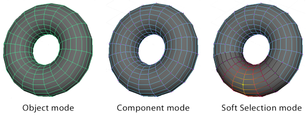
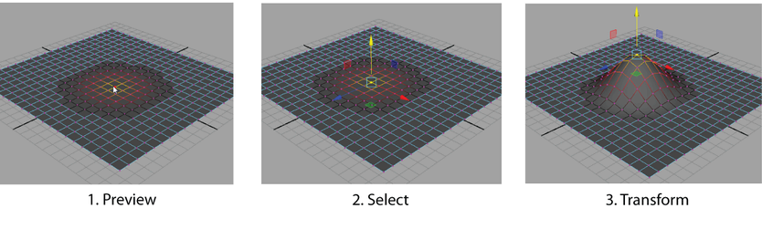

**소프트 셀렉션(Soft Selection)**은 정점(vertices), 간선(edges), 면(faces), UV, 심지어 여러 개의 메쉬마저도 보다 유기적인 방식으로 선택하도록 도와주는 선택 도구다.

소프트 셀렉션은 일반적인 선택 모드처럼 선택한 컴포넌트가 주변의 컴포넌트들에서 떨어져나가는 것을 방지하고 보다 부드러운 변형을 만들어낸다. 예컨대, 평면의 정점 하나를 선택한 다음 y축의 양의 방향으로 끌어올리면 정점 끝으로 하는 뾰족한 스파이크(spike)가 발생하지만 소프트 셀렉션을 사용해 끌어올리면 선택한 정점의 주변의 경사가 완만하고 그 끝이 동그랗게 유지되는 것을 확인할 수 있다.

참고로, 소프트 셀렉션의 단축키는 **B**다. 단축키 **B** 누름으로써 소프트 셀렉션 모드를 켜거나 끌 수 있다.
