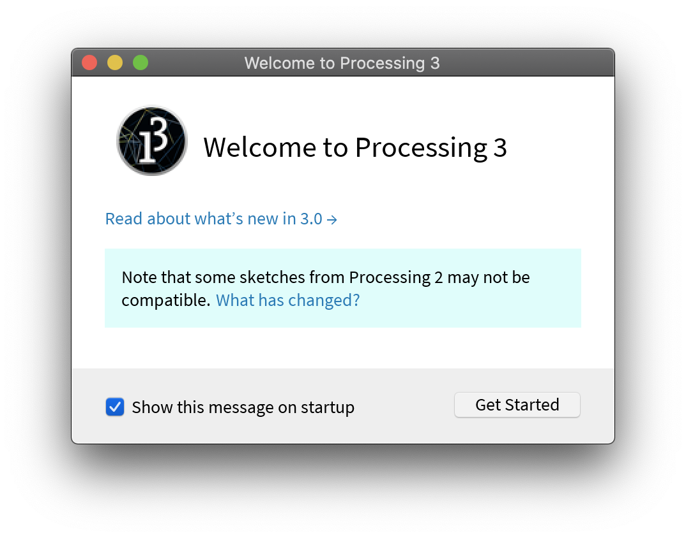
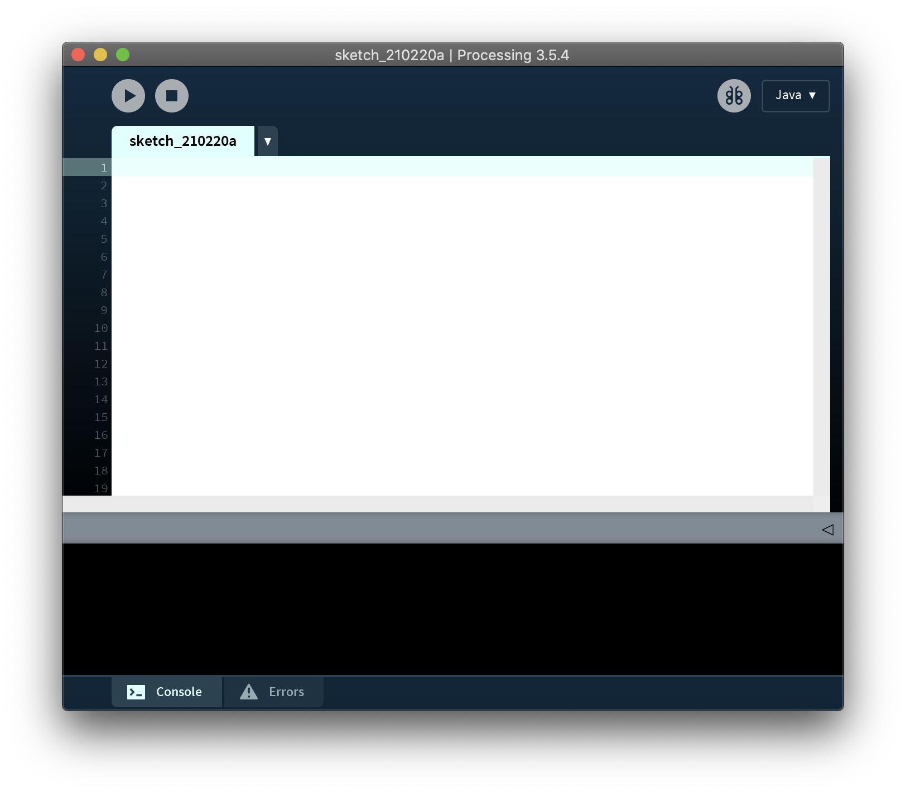

[프로세싱 공식 홈페이지]: https://processing.org
[프로세싱 공식 다운로드 페이지]: https://processing.org/download/

[프로세싱 공식 다운로드 페이지]에서 사용 중인 운영체제에 따른 버전을 다운받는다. 프로세싱 소프트웨어는 압축 파일로 제공되므로 압축을 푼 다음 macOS의 경우에는 다음 `Applications` 경로에 압축을 푼 내용물(content)을 옮길 필요가 있다.

```
/Users/[사용자_이름]/Applications
```

macOS 기준으로 `Processing.app`을 실행하면 다음과 같은 환영 팝업(popup) 메시지가 뜬다. 다음에 같은 메시지를 보고 싶지 않다면 `Show this message on startup` 토글(toggle)을 해제하면 된다.



환영 팝업 메시지를 닫으면 빈 스케치(Sketch) 파일과 함께 프로세싱이 성공적으로 실행된다.


