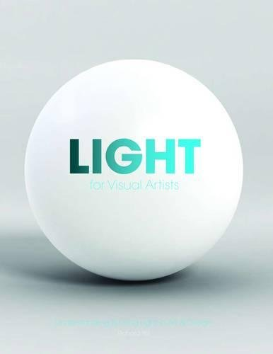

『Light for Visual Artists』 원서를 읽고 남긴 독서 노트. 한국에서는 『Light 미술가를 위한 빛의 이해와 활용』이라는 이름으로 번역서가 출간되어있다. 이 독서 노트를 남기는 목적은 드로잉과 페인팅, 렌더링과 셰이더의 기반이 되는 빛의 원리 이해에 있다. 필요한 대로 찾아 읽고 각 챕터마다 가장 중요한 내용을 문단 단위로 요약해 기록할 예정.

## 목차

### 파트 1: 빛의 기초

#### 챕터 1: 기본 원리

#### 챕터 2: 빛의 방향

#### 챕터 3: 자연광

#### 챕터 4: 실내 및 인공 조명

#### 챕터 5: 그림자

#### 챕터 6: 우리는 어떻게 표면을 인지하는가

#### 챕터 7: 난반사(Diffuse Reflection)

#### 챕터 8: 정반사(Specular Reflection)

#### 챕터 9: 반투명과 투명(Translucency  and Transparency)

#### 챕터 10: 색

### 파트 2: 사람과 환경

#### 챕터 11: 빛과 사람

#### 챕터 12: 환경 속에서의 빛

#### 챕터 13: 창의적인 빛의 활용

#### 챕터 14: 분위기와 상징주의

#### 챕터 15: 시간과 공간

#### 용어 사전

#### 색인
