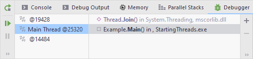

원문: [Run, debug, test, deploy | Debugging | Debug multithreaded applications](https://www.jetbrains.com/help/rider/Debugging_Multithreaded_Applications.html)

멀티스레드 어플리케이션은 여러 스레드를 동시에 추적해야 하기 때문에 디버깅하기 힘들다. 심지어, 멀티스레드 어플리케이션은 불균등한 부하 분산, 락(lock) 경쟁, 직렬화된 실행 등의 새로운 형태의 버그와 성능 문제를 일으킨다.

멀티스레드 앱에서 순서대로 밟아나가는 디버깅 세션의 순차적 플로우의 환상은 실수를 유발할 수 있다. 동시성(concurrency) 버그를 일으킬 수 있는 문제를 조사 중일 때는 순서대로 밟아나가는 디버깅보다는 브레이크포인트를 거는 것이 하나의 스레드에 집중하기에는 더 좋을 수 있다. 스레드에 스레드 ID 등의 유일무이한 프로퍼티를 추가함으로써 브레이크포인트를 실행시키면 어떤 스레드든 해당 객체의 표시된 프로퍼티를 변경시키는 순간 데이터 프레이크포인트가 실행을 멈출 것이다.

JetBrains의 Rider는 멀티스레드 어플리케이션의 디버깅을 단순화시키는 다음 기능들을 제공한다:

- 좌측의 **Threads** 패널은 어플리케이션의 모든 스레드들을 표시한다.

- 우측의 **Frames** 화면은 선택된 스레드의 모든 스택 프레임을 표시한다.

- **Parallel Stacks** 패널은 스레드 분석을 단순화시켜 스레드와 해당 스레드의 스택 프레임을 다이어그램의 형태로 표시한다.
