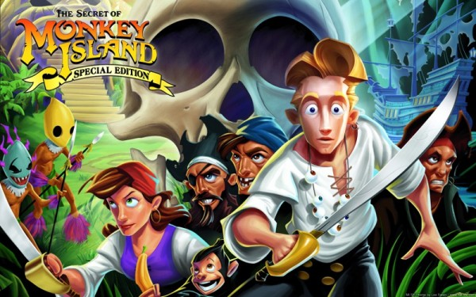

나는 이미 몇 년 간 이미지 프로세싱 데모를 굉장히 많이 올렸지만, 그 중에서도 회색톤(grayscale) 변환 기법이야말로 가장 많은 이메일 상의 문의를 받은 기법이다. 마침내 이 지면에서 해당 질문들에 대한 답을 하게 되어 기쁘다.

회색톤에 대한 문의를 많이 받았지만 나는 차별화되는 뭔가를 보여줄 수 있을 때까지 코딩을 미뤘다. 나는 RGB 컬러를 회색톤으로 바꾸는 표준 변환 코드를 모든 프로그래밍 언어로 작성하는 식으로 하나도 신기하거나 흥미롭지 않은 프로젝트를 더하고 싶지는 않았다. 그래서 "여기 회색톤 알고리즘이 있습니다"라는 글을 쓰는 대신에 나는 일주일 간 지금까지 알려진 모든 회색톤 변환 방식을 조사했다. 내가 알기로는 7가지 회색톤 변환 기법을 모두 소개한 글은 이 글 외에 인터넷 상에서 존재한 적이 없었다.

## 회색톤 - 서론

[흑백 (단색) 사진](https://en.wikipedia.org/wiki/Monochrome_photography)은 19세기 중반으로 거슬러 올라간다. 컬러 사진의 소개에도 불구하고, 단색 사진은 여전히 인기를 끌었다. 굳이 따지자면 디지털 혁명은 단색 사진이 더 유행하게 만들었는데 왜냐하면 아날로그 카메라는 흑백 사진을 찍기 위해 특별한 단색 필름을 필요로 한 반면, 디지털 카메라에는 그 자체로 흑백 사진을 찍는 기능이 탑재되어 있었기 때문이다. 단색 사진은 흔히 사진술에 있어서의 "조각"으로 분류되었다. 단색 사진은 피사체를 추상화시킴으로써 사진가가 형태와 해석에 집중하도록 만들었기 때문이다.

하지만 흑백 사진이 실제로는 여러 단계의 회색 음영으로 구성된다는 점에서 "흑백"이란 용어는 부정확하다. 따라서 이 글에서는 해당 이미지를 회색톤(grayscale)이라고 지칭하도록 하겠다.

여러 가지의 기술적 용어들이 내 설명에서 쓰일 것이다. 그 첫 번째는 "**[컬러 스페이스(color space)](http://en.wikipedia.org/wiki/Color_space)**"다. 컬러 스페이스는 모든 사용가능한 컬러를 사용해 형태나 물체를 시각화하는 방식을 뜻한다. 색을 재현하는 여러 다른 방식들은 각각의 컬러 스페이스를 만들어낸다. 예컨대, [RGB 컬러 스페이스는 일종의 정사각형(cube)](http://en.wikipedia.org/wiki/RGB_color_space)으로 표현되며, [HSL의 경우는 원통(cylinder), 원뿔(cone), 두 원뿔이 위아래로 합쳐진 모양(bicone)](http://en.wikipedia.org/wiki/HSL_color_space), 그리고 [YIQ](http://en.wikipedia.org/wiki/YIQ)와 [YPbPr](http://en.wikipedia.org/wiki/YPbPr)는 보다 더 추상적인 형태를 띌 수 있다. 이 글은 RGB와 HSL 컬러 스페이스를 주로 다루기도 한다.

나는 또한 **[컬러 채널](http://en.wikipedia.org/wiki/Color_channel)**이라는 용어를 자주 언급하게 될 것이다. 대부분의 디지털 이미지들은 3가지로 구분된 컬러 채널로 구성된다: 빨강(red) 채널, 초록(green) 채널, 파랑(blue) 채널이 바로 그것이이다. 이 채널들을 서로 겹겹이 쌓아올리면 하나의 풀컬러 이미지가 완성되는 것이다. 서로 다른 채널 모델은 서로 다른 각각의 채널들을 갖고 있다. 어떤 경우 채널은 그 자체가 컬러에 해당하고, 또 다른 경우의 채널은 명도(lightness)나 채도(saturation)와 같은 다른 값을 뜻할 수 있다. 하지만 이 글에서는 RGB 채널에 한정해 채널을 논하기로 한다.

## 모든 회색톤 알고리즘이 작동하는 근본 원리

모든 회색톤 알고리즘은 다음의 3단계 프로세스를 거친다:

1. 각 픽셀의 빨강, 초록, 파랑 값을 가져온다
2. 특정 수학 공식을 통해 복수의 해당 값들을 단일한 회색 값으로 변환한다
3. 기존의 빨강, 초록, 파랑 값들을 이 회색 값으로 교체한다(또는 덮어씌운다)

나는 특히 수학을 통해 컬러 값들을 회색 값으로 변환하는 이 2번째 단계를 중심으로 회색톤 변환 알고리즘을 설명할 것이다. 예컨대, 다음 공식을 보게 되면:

```hlsl
Gray = (Red + Green + Blue) / 3
```

이러한 공식은 실제 코드로는 다음과 같은 알고리즘으로 표현될 수 있다:

```hlsl
For Each Pixel in Image {

   Red = Pixel.Red
   Green = Pixel.Green
   Blue = Pixel.Blue

   Gray = (Red + Green + Blue) / 3

   Pixel.Red = Gray
   Pixel.Green = Gray
   Pixel.Blue = Gray

}
```

이제 해당 회색톤 알고리즘들을 둘러보도록 하자.

## 샘플 이미지:



위의 화사하고 컬러풀한 「원숭이 섬의 비밀: 특별판」의 프로모 아트는 우리가 알아보게 될 7가지 회색톤 알고리즘의 데모에 쓰일 이미지이다.

## 방법 1 - 평준화 (소위 "빠르지만 더럽게")


이 메소드는 가장 지루한 방식이지만 7가지 회색톤 알고리즘 중 첫 번째 알고리즘으로 다루도록 하자. "평준화(Averaging)"는 회색톤 변환의 가장 흔한 예로서 다음과 같이 작동한다:

```hlsl
Gray = (Red + Green + Blue) / 3
```

이는 빠르고 단순하다 - 의심의 여지 없이 이 회색톤 알고리즘은 초보 프로그래머가 가장 먼저 찾아 쓸 법한 알고리즘이다. 이 공식은 꽤 괜찮은 회색톤 변환을 제공하며 그 단순성은 구현과 최적화를 쉽게 해준다 (룩-업 데이블 역시 이 알고리즘의 최적화에 잘 들어맞는다). 그러나, 이 공식은 빠르고 단순한 장점만을 가지고 있는 것은 아니다. 이 알고리즘은 인간이 인지하는 광도(luminosity)/명도에 비하면 회색의 음영을 표현하는데 형편없는 수준의 결과를 보여준다. 이러한 회색 음영의 보다 섬세한 표현을 위해서는 보다 복잡한 알고리즘을 사용할 필요가 있다.

## 방법 2 - 인간의 눈[^1]에 맞춘 보정


이 이미지와 방법 1(평준화)을 통해 생성된 상단의 이미지의 미묘한 차이를 발견하는 것은 어려운 일이다. 그래서 나는 아래에 이미지 상단은 방법 1(평준화) 방식을 사용해 변환하고 이미지 하단은 방법 2(인간의 눈에 맞춘 보정)를 사용해 변환해보았다:


위의 이미지를 면밀하게 살펴보면, 이미지 중앙을 가로지르는 수평선을 찾을 수 있을 것이다. 이 수평선의 상단(평준화)의 경우는 하단에 비해 약간 더 물이 빠진 느낌을 확인할 수 있을 것이다. 이는 특히 이미지의 좌측 중앙 부분에서 더 두드러지는데, 이는 배경 해골의 광대뼈 하단부에 해당한다.

방법 1과 방법 2의 차이는 아래 제공되는 소스 코드를 사용해 이미지를 변환한 뒤 전체화면으로 비교하면 더 극명해진다. 글 말미에 첨부된 샘플 프로젝트를 다운받아 다양한 회색톤 변환 알고리즘으로 이미지들을 병치해놓고 비교해보자.

두 번쨰 알고리즘은 인간의 눈의 원뿔형 시야의 밀도가 모든 컬러에 있어 균일하지 않다든 점에 착안해 이를 모방하는 알고리즘이다. 인간의 눈은 빨강보다는 초록을 더 민감하게 받아들이고 파랑보다는 빨강을 더 민감하게 받아들인다(초록 > 빨강 > 파랑). 이는 진화생물학의 관점에서 자연 세계가 대부분 초록의 음영으로 이루어져있다는 점에서 발생한 것이다. 이 때문에 인간의 눈은 초록 빛깔을 더 민감하고 섬세하게 인지하도록 진화했다 (이는 과하게 단순화한 감이 있지만 사실이다).

인간이 이처럼 모든 색상을 동일하게 받아들이지 않기 때문에 "평준화 방법"은 부정확하다. 때문에 방법 2는 빨강, 초록, 파랑 빛깔을 동등하게 취급하는 대신에 인간의 눈을 모사해 각 색깔에 가중치를 둔다. Photoshop이나 [GIMP](http://gimp-savvy.com/BOOK/index.html?node54.html)와 같은 이미지 프로세스에서 흔히 쓰이는 공식은 다음과 같다:

```hlsl
Gray = (Red * 0.3 + Green * 0.59 + Blue * 0.11)
```

빨강, 초록, 그리고 파랑에 곱해지는 계수(coefficients) 사이의 격차가 꽤 큰 것이 놀라울 것이다. 그렇지 않은가? 이 공식은 추가적인 연산을 필요로 하지만, 이는 보다 역동적인 회색톤 이미지를 제공한다. 다시 말하지만, 아래의 샘플 프로그램을 다운받아 이를 시험해보는 것이 이를 감상하는 최고의 방법이다. 이제 첨부된 코드를 가지고 실험을 한 다음 이 글로 다시 돌아오도록 한다.

단, 방법 2에서 인간의 눈을 모사하는 방법의 경우, 무엇이 회색톤 변환을 위한 최고의 공식이냐에 대한 의견의 일치가 이루어지고 있지 않다는 점에 주의해야 한다. 아래 샘플 프로젝트에서 나는 ITU-R 알고리즘(BT.709)을 사용했으며 이는 역사적으로 가장 앞선 것이다. "Luma"라고 불리는 이 공식은 다음과 같다:

```hlsl
Gray = (Red * 0.2126 + Green * 0.7152 + Blue * 0.0722)
```

현대 디지털 이미지와 비디오 포맷은 다른 알고리즘(BT.601)을 사용하며, 이는 약간 다른 계수들을 이용한 변환을 수행한다.

```hlsl
Gray = (Red * 0.299 + Green * 0.587 + Blue * 0.114)
```

무엇이 더 나은 공식이냐에 대한 논의를 다루는 것은 이 글의 다룰 주제를 넘어선다. 이에 관심있는 독자들은 Charles Poynton의 저술을 참고하길 바란다. 99%의 프로그래머들에게는 이러한 두 공식의 차이는 큰 의미가 없을 것이다. 이 두 공식은 흔히 "평준화 방법"보다 더 나은 회색톤 변환으로 여겨진다.

## 방법 3 - 채도 낮추기(Desaturation)

> 번역 진행 중...

**[GitHub에서 소스 코드 다운받기](https://github.com/tannerhelland/vb6-code/tree/master/Grayscale-effect)**

[^1]: 이는 가끔 “luma” 또는 “휘도(luminance)”라고 불리지만 [이 용어는 정확한 용어가 아니다](http://poynton.com/PDFs/YUV_and_luminance_harmful.pdf)

---

> 원문: [Seven grayscale conversion algorithms (with pseudocode and VB6 source code) | tannerhelland.com](http://www.tannerhelland.com/3643/grayscale-image-algorithm-vb6/)
