본 포스팅은 Pope Kim의 『셰이더 프로그래밍 입문 (한빛미디어, 2012)』의 Part 1의 Chapter 2에 해당하는 내용(p. 46-74)을 요약하기 위해 작성되었다.

## Pope Kim의 셰이더의 정의

"화면에 출력할 **픽셀**의 **위치**와 **색상**을 계산하는 함수."

## 학습 목표

**"진짜 쉬운 빨강 셰이더"**를 직접 만들어봄으로써 "화면에 출력할 픽셀의 위치와 색상을 계산하는 함수"로서의 셰이더를 작성하고 그 구조와 활용법을 이해할 수 있다.

## "진짜 쉬운 빨강 셰이더" 만들기

### 개발 환경 설정: 바닥부터 만들기

1. [렌더몽키](https://gpuopen.com/wp-content/uploads/2017/01/RenderMonkey.2008-12-17-v1.82.322.msi.zip)를 설치한다
2. 렌더몽키를 실행한다

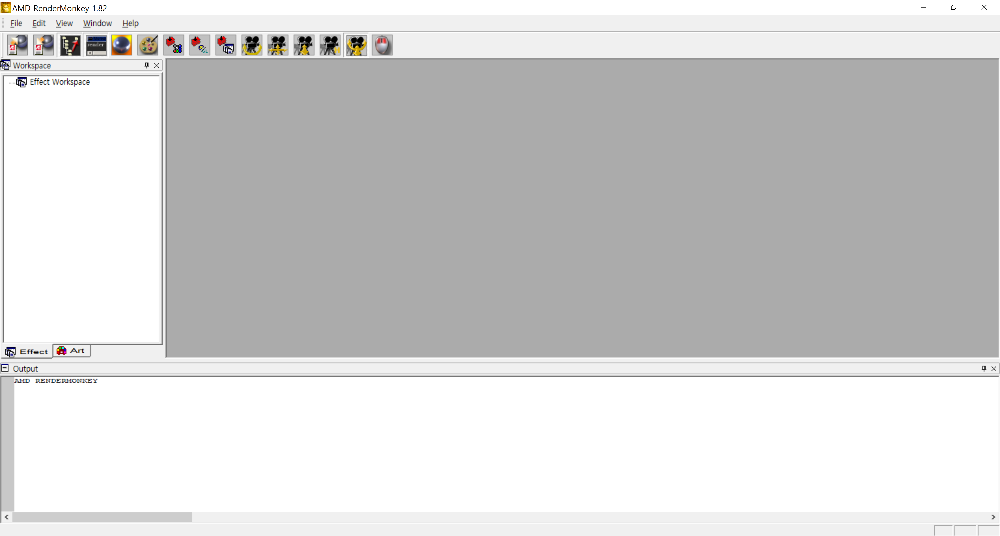

3. Effect Workspace 오른쪽 클릭 > Add Default Effect > DirectX > DirectX 메뉴 선택

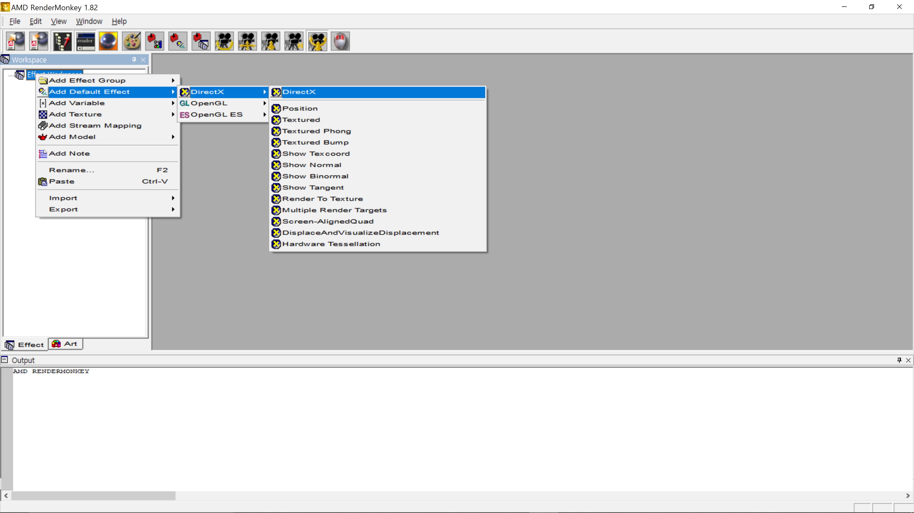

4. 이제 다음과 같이 빨간 공이 별도의 창에 출력될 것이다

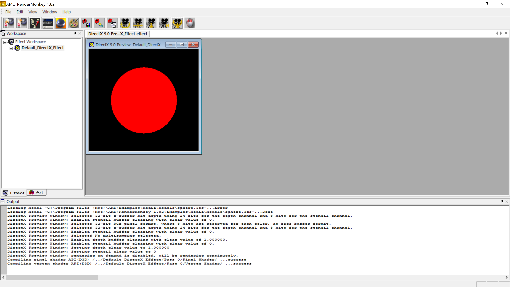

5. 우리는 특정 색(빨강)을 출력하는 셰이더를 만들 것이기 때문에 이펙트의 이름을 기본값인 "Default_DirectX_Effect"에서 "ColorShader"로 변경한다

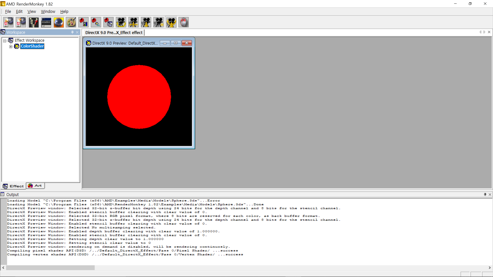

6. 이제 이후의 학습을 위해 기존 셰이더 코드를 지우고 변수를 삭제한다. 좌측의 Workspace 창에서 "Pass 0" 항목을 찾아 그 옆의 '+ (확장)' 버튼을 누르면 정점 셰이더(Vertex Shader)와 픽셀 셰이더(Pixel Shader) 항목이 자식으로 포함되어 있는 것을 알 수 있다. 이 두 코드의 내용을 일괄 선택한 뒤 깨끗이 삭제한다

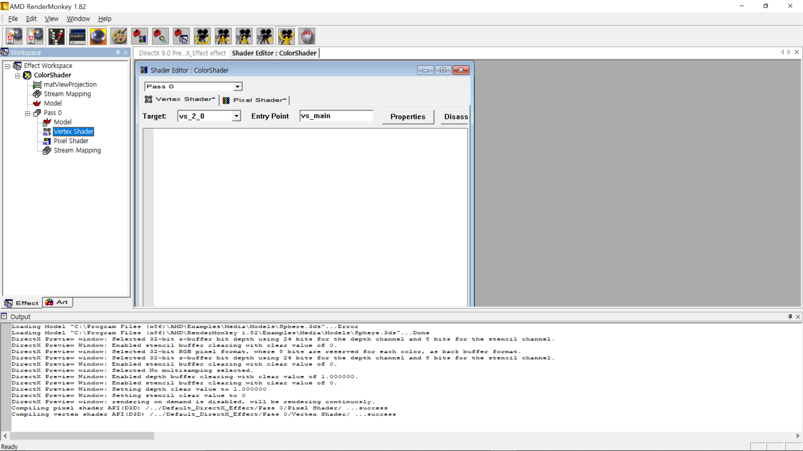

7. 변수 삭제의 경우는, 좌측의 Workspace 창에서 "matViewProjection"을 선택한 뒤 "Delete"를 클릭해 삭제해주면 된다

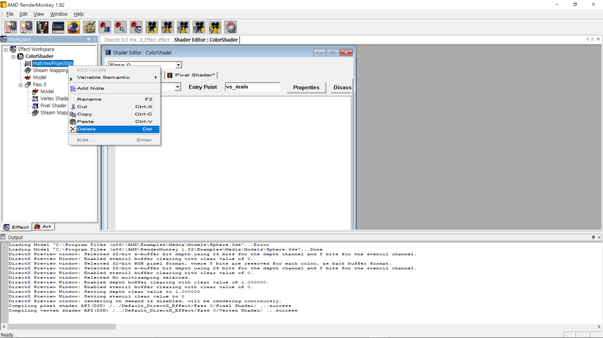

8. 이제 새로운 셰이더 코드를 바닥부터 작성할 준비가 끝났다

### 전역 변수의 선언

1.  우선 전역 변수로 사용할 월드 행렬(World Matrix), 뷰 행렬(View Matrix), 투영 행렬(Projection Matrix)를 차례대로 만든다. 일단 다음과 같이 float4x4 타입의 행렬을 하나 만든다

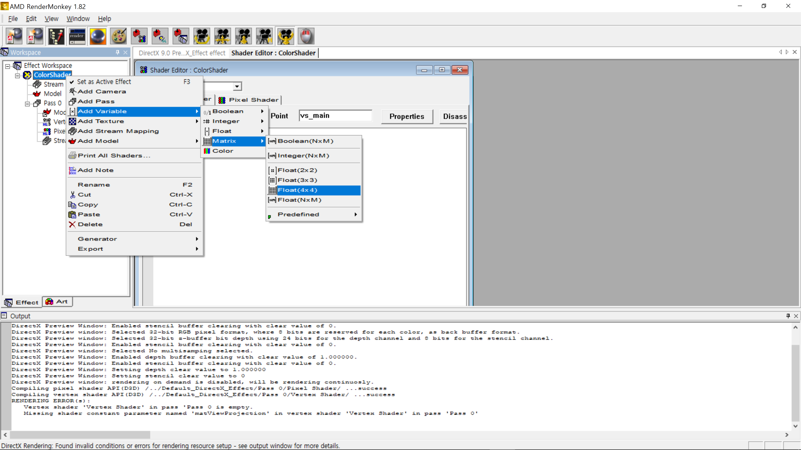

2. 해당 행렬의 변수명을 기본값인 "f4x4MyMatrix"에서 "gWorldMatrix"로 변경한다. 그리고 렌더몽키에서 제공하는 변수 시멘틱(variable semantic)을 활용해 월드 행렬 값을 대입한다. 월드 행렬 값은 해당 변수를 오른쪽 클릭한 다음 Variable Semantic > World를 선택해 대입해주면 된다

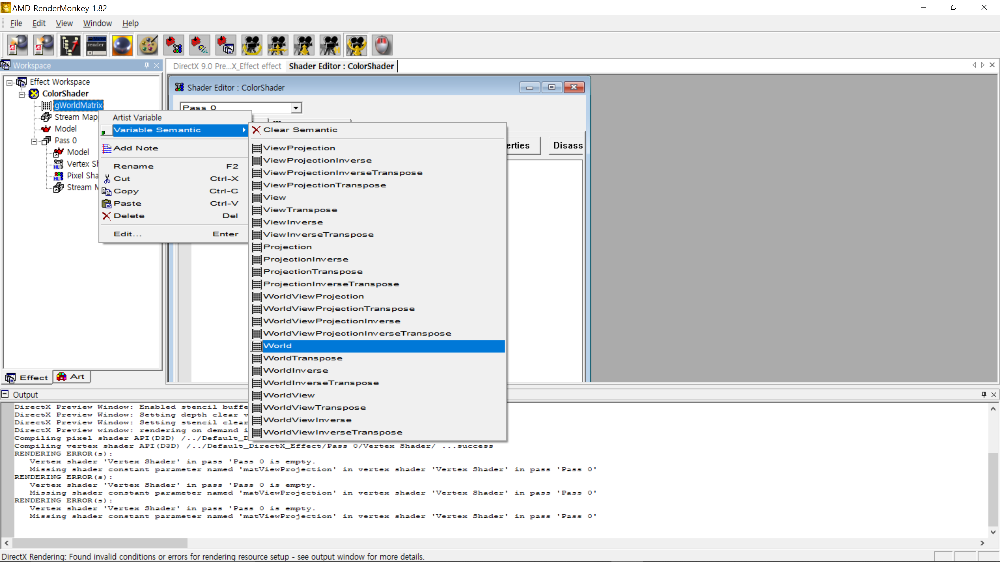

3. 같은 식으로 "gViewMatrix", "gProjectionMatrix" 변수를 생성한 뒤 각각 Variable Semantic > View와 Variable Semantic > Projection을 대입한다

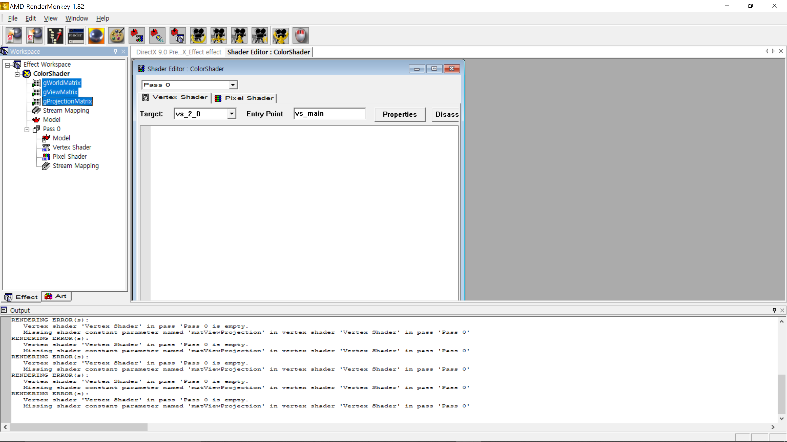

4. 이제 셰이더 함수에서 사용할 전역 변수들이 준비되었다

### 정점 셰이더 함수 구현: 위치 구하기

1. 이제 본격적으로 셰이더 함수를 구현해보도록 하자. 위에서 우리는 기존의 세이더 코드를 지웠지만 "Pass 0" 항목 내의 "Vertex Shader" 항목 자체는 남아있을 것이다. 해당 항목을 선택하면 열리는 "Shader Editor" 입력창에 코드를 작성해보자

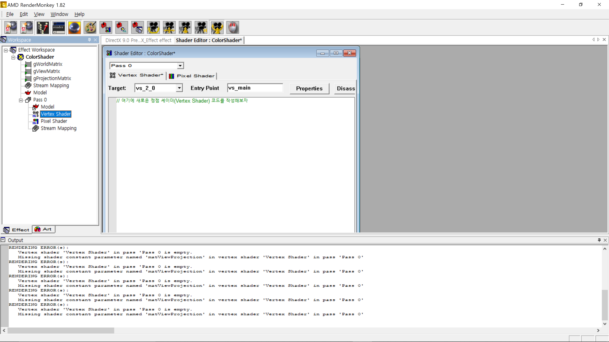

2. 일단 앞에서 생성한 전역 변수를 먼저 선언하도록 하자

```hlsl
float4x4 gWorldMatrix;
float4x4 gViewMatrix;
float4x4 gProjectionMatrix;
```

3. 함수는 입력과 출력을 필요로 한다. 따라서 입력과 출력 구조체를 선언하도록 한다

```hlsl
struct VS_INPUT 
{
   float4 mPosition : POSITION; 
};

struct VS_OUTPUT 
{
   float4 mPosition : POSITION;
};
```

4. 그 다음, 본격적으로 정점 셰이더 함수를 작성한다

```hlsl
VS_OUTPUT vs_main( VS_INPUT Input )
{
   VS_OUTPUT Output;

   Output.mPosition = mul( Input.mPosition, gWorldMatrix );         // 월드 행렬로 공간 변환
   Output.mPosition = mul( Output.mPosition, gViewMatrix );          // 뷰 행렬로 공간 변환
   Output.mPosition = mul( Output.mPosition, gProjectionMatrix );    // 투영 행렬로 공간 변환
   
   return Output;
}
```

> `error X3000: syntax error: unexpected token 'struct'` 에러가 발생하는 경우에는 혹시 세미콜론 `;`을 빼먹지는 않았는지 확인해보자. struct를 선언한 다음 선언을 종료하는 중괄호 끝에 세미콜론 `;`을 빼먹는 실수가 잦고, 또 찾기도 어렵다. 늘 문법적으로 유효한(valid) 코드를 작성하는데 유의하도록 한다

5. 다음 메시지가 "Output" 창에 출력되면 정점 셰이더를 성공적으로 구현한 것이다

```
Compiling vertex shader API(D3D) /../Default_DirectX_Effect/Pass 0/Vertex Shader/ ...success
```

### 픽셀 셰이더 함수 구현: 색상 구하기

1. 정점 셰이더를 성공적으로 구현했지만 "Preview" 창에는 까만 화면 외에 아무 것도 보이지 않는다. 당연히 이는 저자가 강조한대로 픽셀의 색을 반환하는 역할을 하는 픽셀 셰이더가 비어있기 때문이다

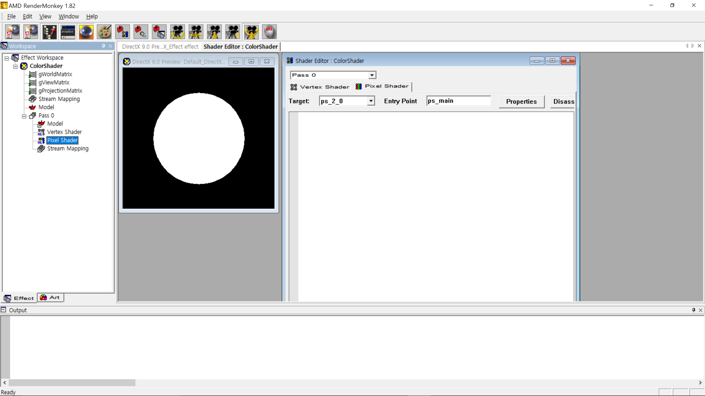

2. 이제 "Pass 0" 아래 "Pixer Shader"를 선택해 다음처럼 픽셀 셰이더를 작성하도록 하자. 픽셀 셰이더는 "픽셀의 색을 반환"해야 하므로 r, g, b, a 총 4개의 float 값을 가지는 색 값을 반환하며 이는 각각 빨간색(red), 초록색(green), 파란색(blue), 알파(alpha) 채널 값에 해당한다

```hlsl
float4 ps_main() : COLOR
{
   return float4 ( 1.0f, 0.0f, 0.0f, 1.0f );
}
```

> `error X3000: syntax error: unexpected token 'f'` 에러가 발생하는 경우에는 혹시 마침표 `.`를 쉼표 `,`로 잘못 적거나 혹은 이 반대로 기입하지 않았는지 다시 한번 확인한다

### 완성된 "진짜 쉬운 빨강 셰이더"

마침내 **"진짜 쉬운 빨강 셰이더"**가 완성되었다. 다들 각자 생애 첫 셰이더를 만든 기쁨을 만끽하도록 하자

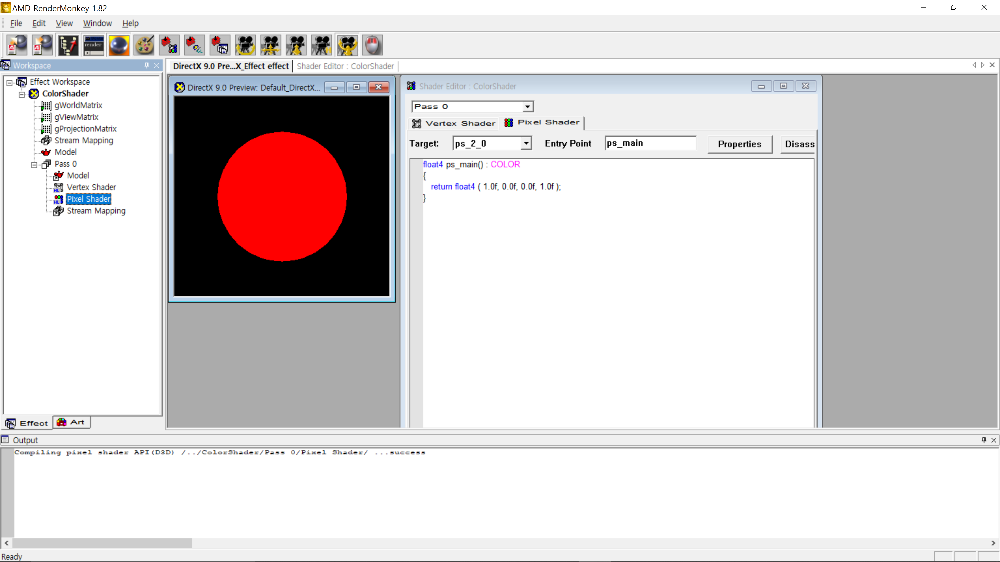

> 만약 실습을 진행하는데 어려움이 있는 경우에는 미리 완성된 다음 프로젝트 파일을 다운로드 받은 뒤 렌더몽키를 통해 열고 직접 분석해보도록 한다: [다운로드 받기](https://github.com/sungkukpark/shader_programming_intro/blob/master/samples/easiest_red_shader/easiest_red_shader.zip)
