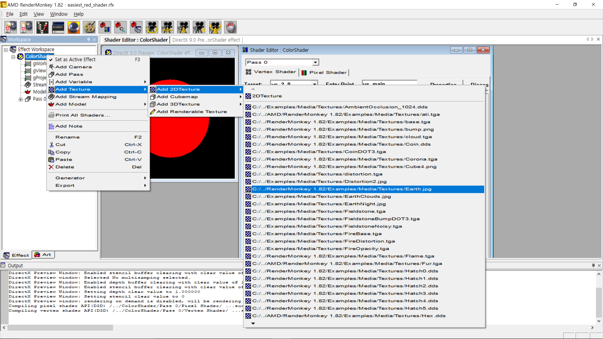
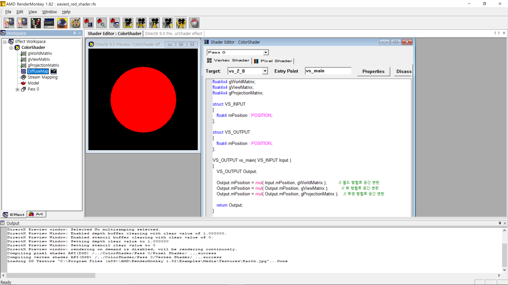
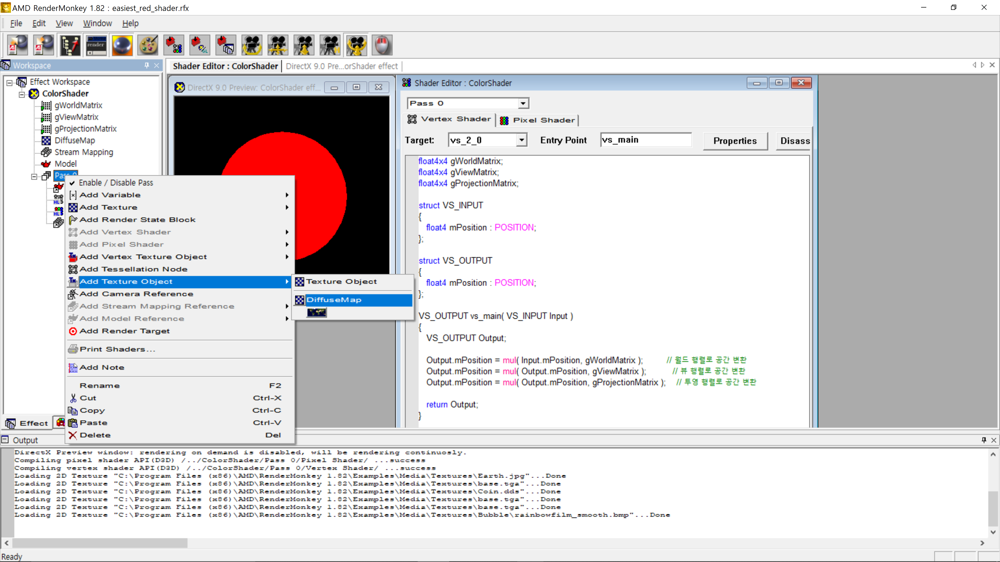
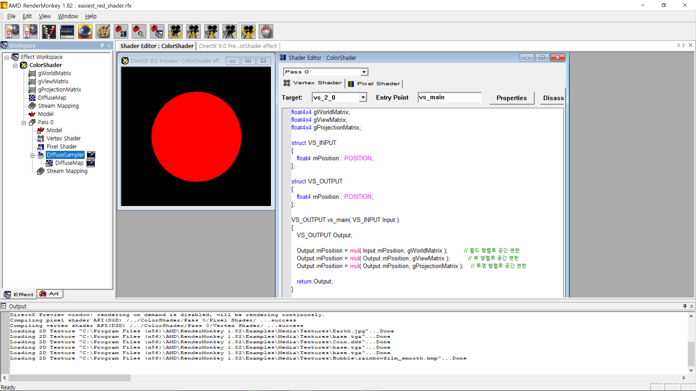
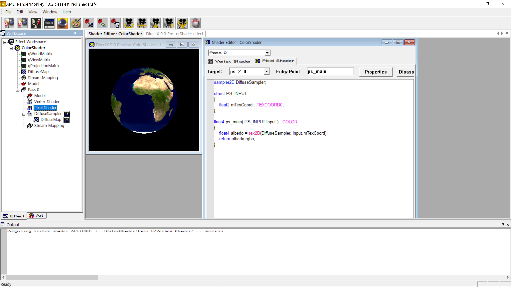

본 포스팅은 Pope Kim의 『셰이더 프로그래밍 입문 (한빛미디어, 2012)』의 Part 1의 Chapter 3에 해당하는 내용(p. 75-92)을 요약하기 위해 작성되었다.

## 학습 목표

셰이더를 통해 모델에 텍스처를 입히는 텍스처매핑(texture mapping)을 구현하고 이 원리를 이해한다.

## 텍스처매핑 구현하기

편의를 위해 "[진짜 쉬운 빨강 셰이더](https://sungkukpark.github.io/shader_programming_intro_2/)"의 완성 시점부터 텍스처 매핑을 구현해보자. 만약 아직 렌더몽키와 HLSL 기초 문법을 숙지하지 못했다면 링크된 페이지를 참조해 앞선 튜토리얼을 먼저 따라해보도록 한다.

### 개발 환경 설정: 텍스처로 사용할 이미지 추가하기

1. "ColorShader"라는 이름의 프로젝트 항목을 오른쪽 클릭한 뒤 Add Texture > Add 2DTexture > [렌더몽키 설치 경로]/Examples/Media/Textures/Earth.jpg 메뉴를 선택해 이미지를 불러온다. 아니면, 만들어진 2DTexture를 오른쪽 클릭한 뒤 Edit... 메뉴를 선택해 원하는 이미지를 불러오도록 한다



2. 추가된 2DTexture의 이름을 "DiffuseMap"으로 변경한다. F2를 누르거나 항목을 오른쪽 클릭하고 Rename 메뉴를 선택하는 것으로 항목의 이름을 변경할 수 있다



### 개발 환경 설정: 텍스처 개체 추가하기

1. 왼쪽 Workspace 창에서 "Pass 0" 항목을 오른쪽 클릭한 뒤 Add Texture Object > DiffuseMap으로 방금 위에서 추가한 텍스처 이미지를 선택한다



2. 생성된 텍스트 개체의 이름을 "Texture0"에서 "DiffuseSampler"로 변경한다



3. 이제 셰이더로 텍스처를 불러올 준비가 되었다

### 정점 셰이더 함수 구현: UV 좌표를 포함한 정점 위치 정보를 반환

본래 정점 셰이더가 하는 일은 **정점의 위치를 투영공간으로 변환시키는 것**이다. 그러면 정점의 위치 정보를 반환해야 할 텐데, 정점 셰이더에서는 꼭 위치 정보**만** 반환해야 하는 것은 아니다. 정점 셰이더는 보간기(interpolator)라는 장치를 통해 정점 위치 이외의 정보를 보간해준다. 따라서 여기서 정점 셰이더가 할 일은 `Output.mTexCoord = Input.mTexCoord;`라는 문장을 통해 UV 좌표를 정점 위치 정보와 함꼐 반환하는 일뿐이다.

```hlsl
float4x4 gWorldMatrix;
float4x4 gViewMatrix;
float4x4 gProjectionMatrix;

struct VS_INPUT 
{
   float4 mPosition : POSITION;
   float2 mTexCoord : TEXCOORD0;
};

struct VS_OUTPUT 
{
   float4 mPosition : POSITION;
   float2 mTexCoord : TEXCOORD0;
};

VS_OUTPUT vs_main( VS_INPUT Input )
{
   VS_OUTPUT Output;

   Output.mPosition = mul( Input.mPosition, gWorldMatrix );         // 월드 행렬로 공간 변환
   Output.mPosition = mul( Output.mPosition, gViewMatrix );          // 뷰 행렬로 공간 변환
   Output.mPosition = mul( Output.mPosition, gProjectionMatrix );    // 투영 행렬로 공간 변환
   
   Output.mTexCoord = Input.mTexCoord;
   
   return Output;
}
```

### 픽셀 셰이더 함수 구현: 텍스처 이미지에서 텍셀(texel)을 계산한 뒤 반환

여기서 픽셀 셰이더가 할 일은 **텍스처 이미지에서 텍셀(texel)을 계산한 뒤 그 색을 화면에 출력하는 것**이다. 이를 위해 존재하는 HLSL 내장 함수 `tex2D`는 매개변수로 1) 텍스처 샘플러(texture sampler)와 2) UV 좌표를 전달받아 그 계산 결과로서의 텍셀 값을 반환해준다. 이제 픽셀 셰이더가 할 일은 이 계산된 텍셀 값을 반환하는 일뿐이다.

```hlsl
sampler2D DiffuseSampler;

struct PS_INPUT
{
    float2 mTexCoord: TEXCOORD0;
};

float4 ps_main( PS_INPUT Input ) : COLOR
{
    float4 albedo = tex2D(DiffuseSampler, Input.mTexCoord);
    return albedo.rgba;
}
```

### 완성된 텍스처맵핑 예제

마침내 텍스처맵핑이 적용된 셰이더가 완성되었다. 다들 각자 생애 첫 텍스처맵핑을 구현한 기쁨을 만끽하도록 하자



> 만약 실습을 진행하는데 어려움이 있는 경우에는 미리 완성된 다음 프로젝트 파일을 다운로드 받은 뒤 렌더몽키를 통해 열고 직접 분석해보도록 한다: [다운로드 받기](https://github.com/sungkukpark/shader_programming_intro/blob/master/samples/texture_mapping/texture_mapping.zip)
