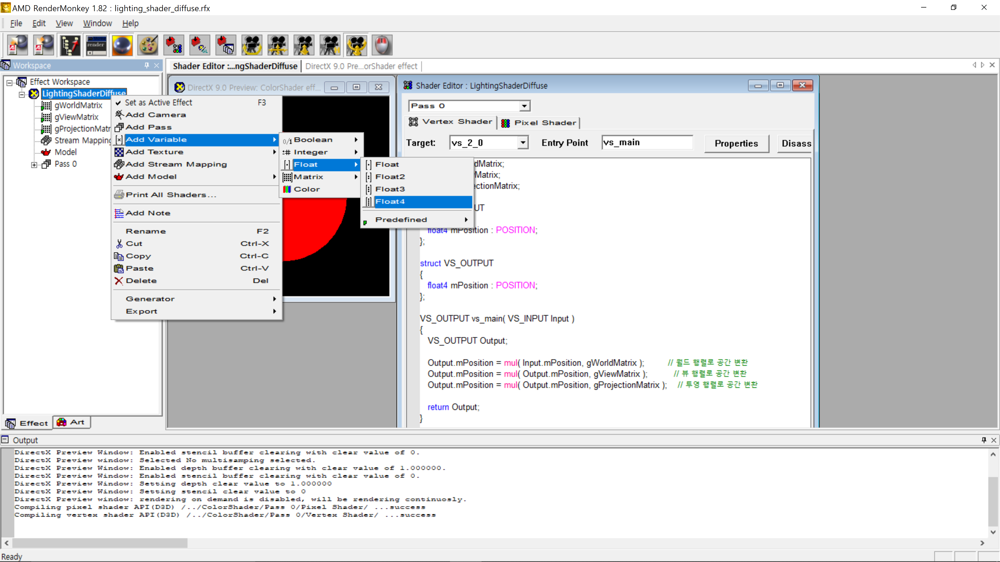
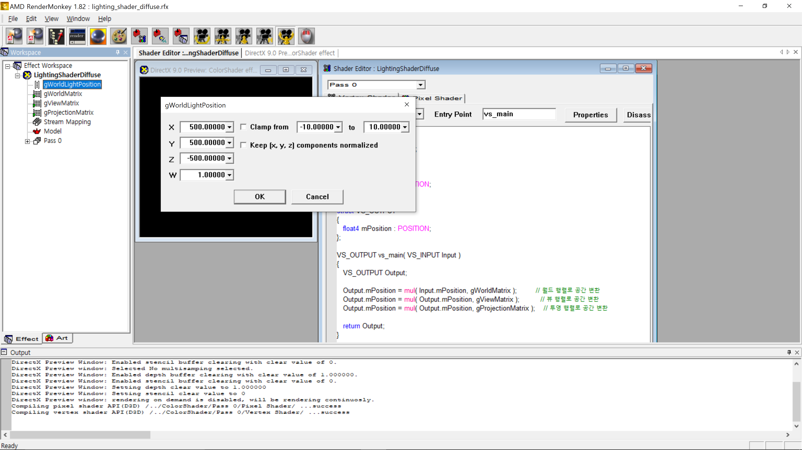
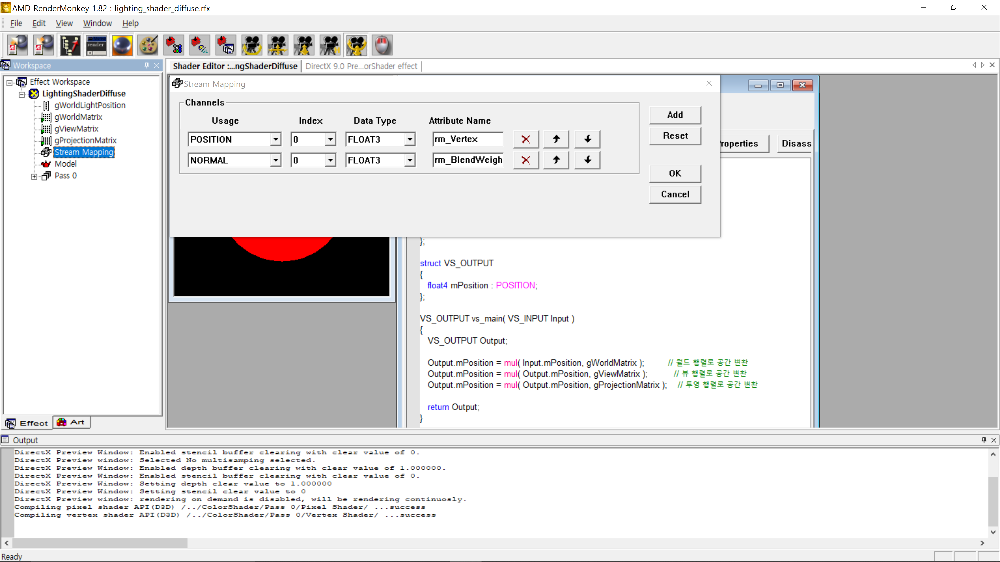
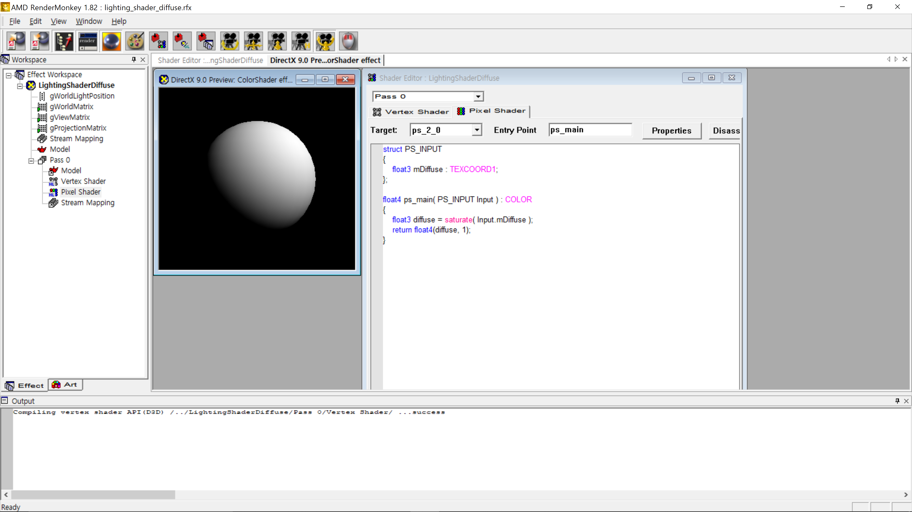

본 포스팅은 Pope Kim의 『셰이더 프로그래밍 입문 (한빛미디어, 2012)』의 Part 1의 Chapter 4에 해당하는 내용(p. 93-107)을 요약하기 위해 작성되었다.

## 학습 목표

셰이더를 통해 난반사광 조명셰이더를 구현하고 이 원리를 이해한다.

## 난반사광 조명셰이더 구현하기

편의를 위해 "[진짜 쉬운 빨강 셰이더](https://sungkukpark.github.io/shader_programming_intro_2/)"의 완성 시점부터 난반사광 조명셰이더를 구현해보자. 만약 아직 렌더몽키와 HLSL 기초 문법을 숙지하지 못했다면 링크된 페이지를 참조해 앞선 튜토리얼을 먼저 따라해보도록 한다.

### 개발 환경 설정: 입사광의 벡터와 표면법선벡터 추가

우선 Workspace 창의 프로젝트 이름을 "ColorShader"에서 "LightingShaderDiffuse"로 변경한다.

#### 입사광 벡터 추가

1. 입사광 벡터 역할을 월드 광원의 위치를 전역 변수로 추가한다



1. 해당 월드 광원의 위치값으로 `(500, 500, -500, 1)`을 대입한다



#### 표면법선 벡터 추가

1. "Stream Mapping" 항목을 더블 클릭한 뒤 "Add" 버튼을 통해 Usage를 "NORMAL", Data Type을 "FLOAT3"로 갖는 항목을 추가한다



### 정점 셰이더 함수 구현: 람베르트 모델을 사용해 난반사광을 계산한 뒤 반환

```hlsl
struct VS_INPUT 
{
   float4 mPosition : POSITION; 
   float3 mNormal : NORMAL;
};

struct VS_OUTPUT 
{
   float4 mPosition : POSITION;
   float3 mDiffuse : TEXCOORD1;
};

float4x4 gWorldMatrix;
float4x4 gViewMatrix;
float4x4 gProjectionMatrix;

float4 gWorldLightPosition;

VS_OUTPUT vs_main( VS_INPUT Input )
{
   VS_OUTPUT Output;

   Output.mPosition = mul( Input.mPosition, gWorldMatrix );         // 월드 행렬로 공간 변환
   
   float3 lightDir = Output.mPosition.xyz - gWorldLightPosition.xyz;
   lightDir = normalize( lightDir );
   
   Output.mPosition = mul( Output.mPosition, gViewMatrix );          // 뷰 행렬로 공간 변환
   Output.mPosition = mul( Output.mPosition, gProjectionMatrix );    // 투영 행렬로 공간 변환
   
   float3 worldNormal = mul ( Input.mNormal, (float3x3)gWorldMatrix );
   worldNormal = normalize( worldNormal );
   
   Output.mDiffuse = dot(- lightDir, worldNormal );
   
   return Output;
}

```

### 픽셀 셰이더 함수 구현: 난반사광 값을 반환

여기서 픽셀 셰이더 함수가 하는 일은 정점 셰이더에서 전달된 난반사광 값을 그대로 반환하는 정도다. 단, 여기서 [saturate HLSL 함수](https://docs.microsoft.com/en-us/windows/win32/direct3dhlsl/dx-graphics-hlsl-saturate)는 특정 값을 0에서 1 사이의 값으로 고정하는 함수이다. 즉, 0보다 작은 값은 0으로, 1보다 작은 값은 1로 고정한다.

```hlsl
struct PS_INPUT
{
    float3 mDiffuse : TEXCOORD1;
};

float4 ps_main( PS_INPUT Input ) : COLOR
{
    float3 diffuse = saturate( Input.mDiffuse );
    return float4(diffuse, 1);
}
```

### 완성된 난반사광 조명셰이더 예제

마침내 난반사광 조명셰이더가 적용된 셰이더가 완성되었다. 다들 각자 생애 첫 난반사광 조명셰이더를 구현한 기쁨을 만끽하도록 하자



> 만약 실습을 진행하는데 어려움이 있는 경우에는 미리 완성된 다음 프로젝트 파일을 다운로드 받은 뒤 렌더몽키를 통해 열고 직접 분석해보도록 한다: [다운로드 받기](https://github.com/sungkukpark/shader_programming_intro/blob/master/samples/lighting_shader_diffuse/lighting_shader_diffuse.zip)
