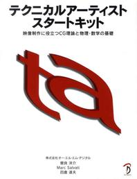
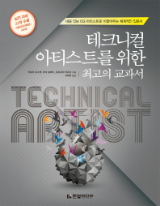

본문은 『테크니컬 아티스트를 위한 최고의 교과서 (한빛미디어, 2014)』를 공부하고 핵심 내용을 요약한 것이다. 이 번역서의 원서는 『テクニカルア-ティストスタ-トキット (ボ-ンデジタル, 2012)』이다.

## 1.1 카메라

### 1.1.1 카메라 구조

카메라란 무엇인가? 카메라는 "**빛을 이미지로 변환하는 기계**"이다. 즉, 카메라라는 기계를 일종의 함수(function)이라고 한다면 입력값은 빛(light)이고 출력값은 이미지(image)가 된다.

카메라는 빛이 먼저 들어오는 순서에 따라 "**렌즈 > 조리개 > 셔터 > 필름**"으로 구성된다. 이때, 조리개와 셔터는 둘 다 빛을 조절하는 역할을 하지만 조리개는 "**필름에 들어가는 빛의 양을 조절**"하는 반면 셔터는 필름이 "**빛을 받아들이는 시간을 조절**"한다는 차이가 있다.

|        | 조리개                         | 셔터                               |
|--------|--------------------------------|------------------------------------|
| 공통점 | 빛을 조절                 |
| 차이점 | 필름에 들어가는 빛의 양을 조절 | 필름이 빛을 받아들이는 시간을 조절 |

#### 렌즈

렌즈를 통과하는 빛은 아래의 세 가지 조건을 만족시킨다.

1. 렌즈의 중심을 지나는 빛은 굴절하지 않는다.
2. 렌즈의 축과 평행하게 통과하는 빛은 렌즈에 의해 굴절하여 렌즈 위의 초점(집중된 한 점)을 통과한다.
3. 렌즈 앞의 초점을 통과한 빛은 렌즈에서 굴절하여 평행해진다.

이때, 수렴된 점(초점)이 촬상면에 오도록 잘 조절하면 선명한 이미지가 나타난다.

또한, 렌즈의 중심(주점)에서 피사체까지의 거리를 a, 렌즈에서 촬상면까지의 거리를 b, 초점 거리를 f라고 하면 다음과 같은 식이 성립한다.

#### 초점 거리

**초점 거리(focal length)**란 "렌즈와 초점 사이의 거리"를 뜻한다.

**초점(focal point)**이란 "평행한 빛을 렌즈를 향해 쏘았을 때 렌즈를 통과한 빛들의 교차점"이다.

초점 거리를 길게 하면 멀리 있는 물체를 크게 찍을 수 있는 반면 더 좁은 범위를 담게 된다. 초점 거리를 짧게 하면 먼 물체는 작게 찍히지만 대신 더 넓은 범위를 담을 수 있다. 이때, 초점 거리가 긴 렌즈를 **망원 렌즈(telephoto lens)**라고 하고 초점 거리가 짧은 렌즈를 **광각 렌즈(wide-angle lens, pantoscope)**라고 한다.

#### 화각

**화각(angle of view)**이란 "카메라가 촬영할 수 있는 범위를 각도로 나타낸 것"이다.

(작성 중)
