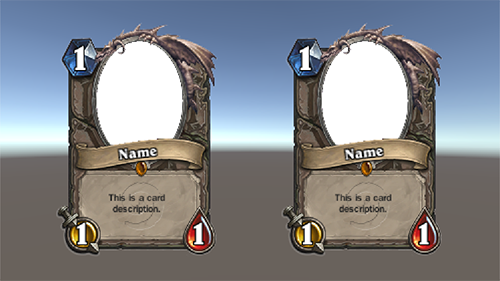
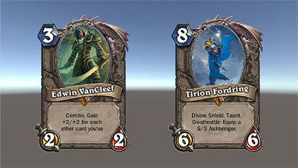

[ScriptableObject]: https://docs.unity3d.com/ScriptReference/ScriptableObject.html
[Introduction to Scriptable Objects]: https://unity3d.com/learn/tutorials/modules/beginner/live-training-archive/scriptable-objects
[Immediate Mode GUI (IMGUI)]: http://sungkukpark.github.io/unity/2018/12/14/unity-immdiate-mode-gui.html
[SCRIPTABLE OBJECTS in Unity]: https://youtu.be/aPXvoWVabPY

원문: [ScriptableObject], [Introduction to Scriptable Objects]

> class in: UnityEngine <br>
> Implemented in: UnityEngine.CoreModuleOther

## ScriptableObject란

ScriptableObject는 기본적으로 **데이터 컨테이너(data container)**이다. 때문에 ScriptableObject는 데이터를 저장할 필요가 있는 어셋에 특히 유용하다.

ScriptableObject는 MonoBehaviour와 일견 비슷해보이지만, MonoBehaviour와 마찬가지로 `UnityEngine.Object`를 상속한 별개의 클래스이다. 이 때문에 MonoBehaviour와 ScriptableObject는 모두 Unity의 월드 내의 존재로 볼 수 있으며 Unity의 직렬화(serialization) 기술의 주체라고 볼 수 있다.

그러나 ScriptableObject는 MonoBehaviour와 달리 GameObject에 부착할 용도로 만들어진 것이 아니며 부착할 수도 없다. 다시 말해, ScriptableObject는 GameObject에 부착할 필요가 없는 객체를 생성할 때 상속할 수 있는 클래스이다.

ScriptableObject의 인스턴스는 프로젝트 내에 ".asset"의 형태로 저장될 수 있다. 이때, 프로젝트 내의 어셋에 종속된 ScriptableObject의 인스턴스를 생성하는 것을 간편히 하기 위해서는 CreateAssetMenuAttribute를 활용하도록 한다.

CreateAssetMenuAttribute는 ScriptableObject를 상속받은 타입으로 하여금 Assets/Create 서브메뉴(submenu)에 등록되게 하며, 이에 따라 각 타입의 인스턴스를 쉽게 생성하고 ".asset" 확장자를 가진 파일로서 프로젝트 내에 저장되도록 지원하는 어트리뷰트(Attribute)이다.

## ScriptableObject의 특징

1. ScriptableObject는 독자적으로 기능하지 않는다.
1. ScriptableObject는 Unity의 [Immediate Mode GUI (IMGUI)]를 활용한 에디터 스크립팅(Editor Scripting)에 의존한다.
1. ScriptableObject는 데이터를 저장 및 보존하는 것이 목적이다.

## ScriptableObject의 사용 목적

ScriptableObject의 사용 목적은 크게 다음 두 가지로 분류할 수 있다:

- 에디터 사용 중에 데이터를 저장하고 보관하는 용도
- 데이터를 ".asset"의 형태로 프로젝트에 저장한 뒤 배포된 빌드 상에서 런타임에 불러와 사용하기 위한 용도

구술하자면,

- 에디터 상에서는 편집 모드와 런타임 모드일 때 ScriptableObject의 형태로 데이터를 저장할 수 있다.
- 배포된 빌드 상에서는 ScriptableObject에 저장된 데이터를 런타임에 불러와 사용할 수 있다.
- 이런 식으로 ScriptableObject를 사용하면 **3rd party의 파일 포맷을 사용하지 않고도 저장 및 불러오기를 구현할 수 있다**.

## ScriptableObject 구현

이번에는 Unity로 Blizzard의 카드 게임 「Hearthstone」을 구현한다고 가정하고 카드 데이터를 보관할 ScriptableObject를 다음과 같이 구현해보자.

```csharp
using UnityEngine;

[CreateAssetMenu]
public class Card : ScriptableObject
{
    public new string name;
    public string description;

    public Sprite artwork;

    public int manaCost;
    public int attack;
    public int health;

    public void Print()
    {
        Debug.Log(name + ": " + description + " 카드의 비용: " + manaCost);
    }
}
```

위의 코드가 컴파일된 이후 `Assets/Create/Card` 메뉴를 선택하면 Card 타입의 ScriptableObject에 대한 인스턴스를 Project 내에 생성할 수 있게 된다. 실제 해당 메뉴를 실행해보면 .asset 확장자를 가진 `"New Card"`란 파일이 생성된다. 여기서 만약 기본 파일명과 메뉴의 경로를 바꾸고 싶다면 다음처럼 CreateAssetMenu 어트리뷰트에 인자를 전달하면 된다:

```csharp
using UnityEngine;

[CreateAssetMenu(fileName = "새로운 카드", menuName = "카드/미니언")]
public class Card : ScriptableObject
{
    public new string name;
    public string description;

    public Sprite artwork;

    public int manaCost;
    public int attack;
    public int health;

    public void Print()
    {
        Debug.Log(name + ": " + description + " 카드의 비용: " + manaCost);
    }
}
```

새로 컴파일을 한 이후에는 `Assets/Create/새로운 카드/미니언` 메뉴를 통해 Card 타입의 ScriptableObject에 대한 인스턴스를 Project 내에 생성할 수 있게 된다. 파일 생성시 초기에 주어지는 이름은 `"새로운 카드"`로 고정된다.

이제 아래과 같은 CardDisplay 스크립트를 작성해 GUI 출력 작업을 해주면 위에서 생성된 Card 타입의 ScriptableObject 인스턴스에서 저장된 데이터를 불러와 출력할 수 있다. Unity GUI는 본문에서 다루는 주제가 아니므로 이와 관련된 설명은 생략한다.

```csharp
using System;
using UnityEngine;
using UnityEngine.Assertions;
using UnityEngine.UI;

public class CardDisplay : MonoBehaviour
{
    // Start() 호출 이전에 Card 타입의 card를 반드시 할당해야 한다.
    public Card card;

    public Text nameText;
    public Text descriptionText;

    public Image artworkImage;

    public Text manaText;
    public Text attackText;
    public Text healthText;

    private void Start()
    {
        try
        {
            card.Print();

            BindCard(card);
        }
        catch (Exception e)
        {
            Debug.LogException(e, this);
        }
    }

    private void BindCard(Card card)
    {
        Assert.IsNotNull(card);

        nameText.text = card.name;
        descriptionText.text = card.description;

        artworkImage.sprite = card.artwork;

        manaText.text = card.manaCost.ToString();
        attackText.text = card.attack.ToString();
        healthText.text = card.health.ToString();
    }
}
```



> 그림 1. ScriptableObject 데이터 불러오기 이전



> 그림 2. ScriptableObject 데이터 불러오기 이후

## 앞으로 더 다뤄야 할 것

Adam Buckner의 [Introduction to Scriptable Objects] 강좌에서는 ScriptableObject가 Unity 상에서 내부적으로 어떻게 동작하는지에 대한 보다 자세한 정보를 포함하고 있다. 그러나 해당 정보까지 모두 포함하게 되면 본문이 지나치게 길어지므로, 이번 포스팅은 ScriptableObject에 빠르게 입문할 수 있는 정도의 정보만을 소개하고 부가적인 정보는 추후 다른 포스팅에서 다루도록 한다.

## 참고 자료

1. [ScriptableObject]
1. [Introduction to Scriptable Objects]
1. [SCRIPTABLE OBJECTS in Unity]
