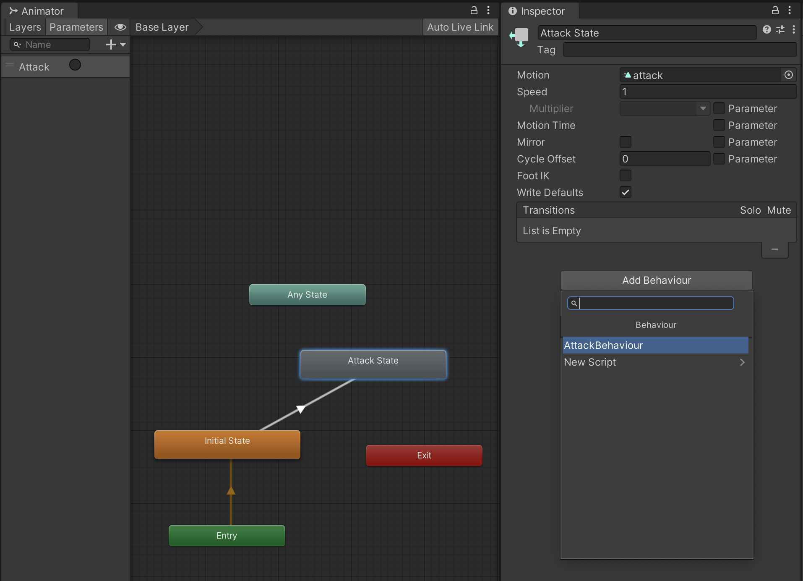
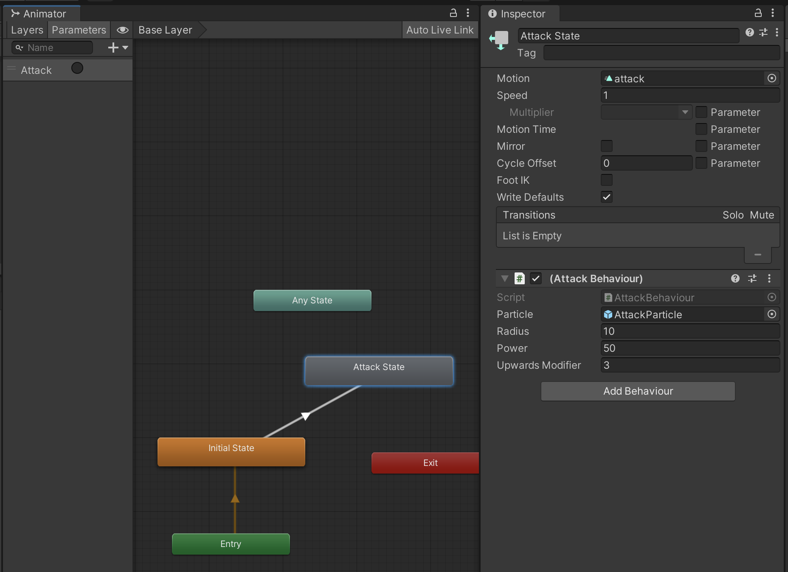

## 문제 제기

나는 이번 스프린트에 "유니티 애니메이터(Animator)를 통해 재생되는 애니메이션 클립([AnimationClip](https://docs.unity3d.com/ScriptReference/AnimationClip.html))의 특정 시점에 커스터마이징 가능한 동작을 추가해야 하는 업무"가 주어졌다. 이에 나는 며칠 간의 리서치 일정을 거쳐 삽질 끝에 **StateMachineBehaviour**를 활용해 해당 기능을 구현하였다. 리서치 기간 동안에는 따로 계획을 하기보다는 정보 수집을 병행해 핵심 기능을 먼저 구현하는 식으로 접근하였다.

특히, 이번 업무는 커스텀 에디터([Custom Editors](https://docs.unity3d.com/Manual/editor-CustomEditors.html))를 통해 해당 동작을 구현해야 했으므로 이러한 특수한 구현이 필요했다. 문제를 해결하는 과정에서 나는 해당 요구사항을 [AnimationClip.AddEvent](https://docs.unity3d.com/ScriptReference/AnimationClip.AddEvent.html) 메서드를 통해 구현했으므로 관심있는 분들은 다음 [[Unity] 애니메이션 이벤트(AnimationEvent) 동적으로 추가하기](https://sungkukpark.github.io/unity_how_to_add_animation_events_dynamically/) 포스팅을 참고하기 바란다.

## 3줄 요약

1. 애니메이터의 특정 상태의 조건에 따라 원하는 동작을 수행하고 싶다면?
2. StateMachineBehaviour를 활용해 해당 동작을 구현한다.
3. 예컨대, 이는 특정 캐릭터의 공격 시점에 특정 이펙트를 생성하거나 등의 용도로 활용할 수 있다.

## StateMachineBehaviour란?

**StateMachineBehaviour**는 애니메이터(Animator)의 스테이트 머신 상태에 추가할 수 있는 컴포넌트(Component)다. StateMachineBehaviour는 상태에 추가되는 모든 스크립트가 상속받는 기반 클래스(base class)다. 즉, 씬(Scene)에 MonoBehaviour가 있다면, 애니메이터에는 StateMachineBehaviour가 있다.

애니메이터는 디폴트 동작으로 애니메이션 컨트롤러에 정의된 모든 StateMachineBehaviour의 인스턴스를 생성한다. 그러나 [SharedBetweenAnimatorsAttribute](https://docs.unity3d.com/ScriptReference/SharedBetweenAnimatorsAttribute.html) 어트리뷰트를 사용하면 해당 인스턴스가 어떻게 생성될 것인지 통제할 수 있다.

StateMachineBehaviour는 다음과 같은 미리 지정된 메시지들을 갖는다:

- OnStateEnter
- OnStateExit
- OnStateIK
- OnStateMove
- OnStateUpdate.

## StateMachineBehaviour 구현을 애니메이터에 추가하는 법

1. 하단의 샘플 코드를 참고해 StateMachineBehaviour를 상속받은 스크립트 파일을 생성한다.

2. 애니메이터 창에서 상태(State) 하나를 선택한 뒤 인스펙터 창에서 "Add Behaviour" 버튼을 클릭한다.



3. 추가된 StateMachineBehaviour 구현에 필요한 `public` 데이터 필드를 모두 채워넣는다.



## [샘플 코드](https://gist.github.com/sungkukpark/cc4c344a7900bd7519cebaf2bb7a3e6d)

```csharp
using UnityEngine;

public class AttackBehaviour : StateMachineBehaviour
{
    public GameObject particle;
    public float radius;
    public float power;
    public float upwardsModifier = 3.0f;

    private GameObject _clone;
    
    // OnStateEnter is called when a transition starts and the state machine starts to evaluate this state.
    public override void OnStateEnter(Animator animator, AnimatorStateInfo stateInfo, int layerIndex)
    {
        _clone = Instantiate(particle, animator.rootPosition, Quaternion.identity);
        var rb = _clone.GetComponent<Rigidbody>();
        rb.AddExplosionForce(power, animator.rootPosition, radius, upwardsModifier);
    }
    
    // OnStateUpdate is called on each Update frame between OnStateEnter and OnStateExit callbacks.
    public override void OnStateUpdate(Animator animator, AnimatorStateInfo stateInfo, int layerIndex)
    {
        Debug.Log("On Attack Update.");
    }

    // OnStateExit is called when a transition ends and the state machine finishes evaluating this state.
    public override void OnStateExit(Animator animator, AnimatorStateInfo stateInfo, int layerIndex)
    {
        Destroy(_clone);
    }
    
    // OnStateMove is called right after Animator.OnAnimatorMove(). Code that processes and affects root motion should be implemented here.
    public override void OnStateMove(Animator animator, AnimatorStateInfo stateInfo, int layerIndex)
    {
        Debug.Log("On Attack Move.");
    }

    // OnStateIK is called right after Animator.OnAnimatorIK(). Code that sets up animation IK (inverse kinematics) should be implemented here.
    public override void OnStateIK(Animator animator, AnimatorStateInfo stateInfo, int layerIndex)
    {
        Debug.Log("On Attack IK.");
    }
}
```

## 참고 자료

- [Unity - Scripting API: StateMachineBehaviour](https://docs.unity3d.com/ScriptReference/StateMachineBehaviour.html)
- [Unity-AssetRequest/DestroyBehaviour.cs at master · tsubaki/Unity-AssetRequest](https://github.com/tsubaki/Unity-AssetRequest/blob/master/Assets/Sample/Script/DestroyBehaviour.cs)