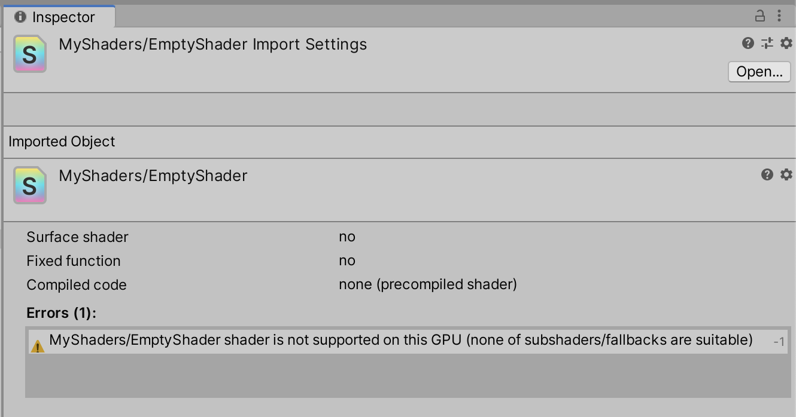
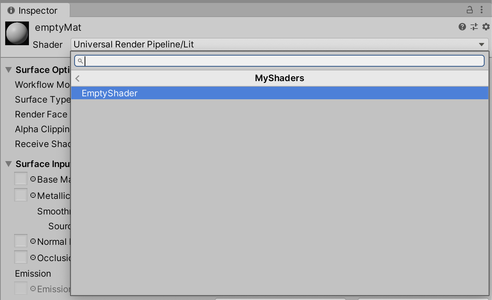
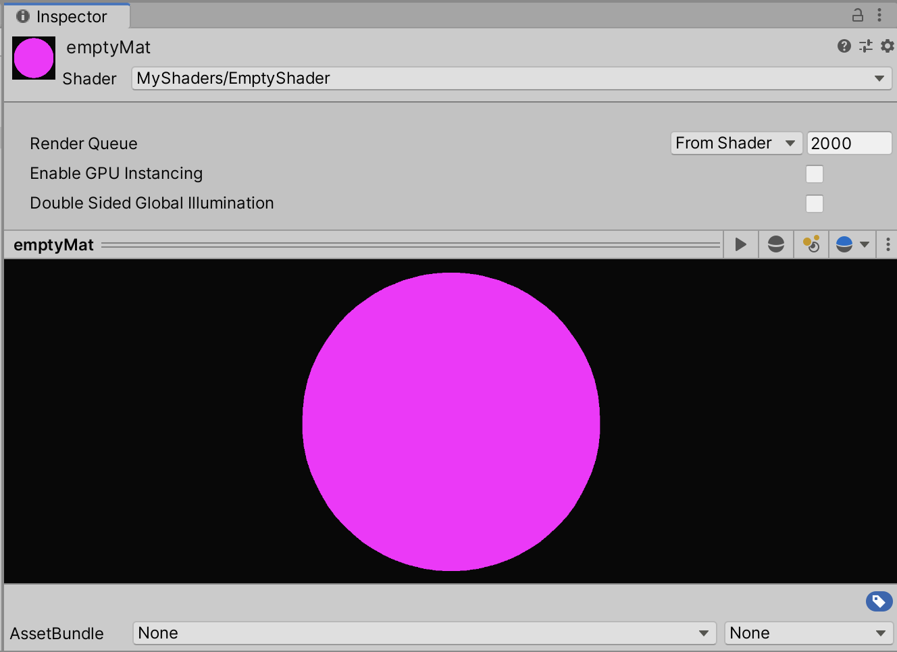

유니티에서 ShaderLab으로 빈 셰이더를 만들어보자. 빈 셰이더를 만드는 것은 아무 것도 없는 백지 상태에서 시작해 우리가 원하는 기능만을 가진 셰이더를 작성하기 위해서다. 이런 식으로 우리는 모르는 코드를 가져다 쓰는 것이 아니라 어떻게 기능하는지 이해하는 코드를 작성할 수 있다.

우선, 유니티에서 다음처럼 Create > Shader > Standard Surface Shader 메뉴를 통해 셰이더 파일 하나를 생성한다. 그러면 .shader 확장자를 가진 셰이더 파일 하나가 만들어질 것이다.


이 파일을 VSCode와 같은 편집기로 열고 해당 파일에 포함된 코드를 전부 선택해 지운다. 이후, 다음과 같이 새로 생성된 빈 셰이더에 이름을 붙여준다.

```glsl
Shader "MyShaders/EmptyShader"
{

}
```

이때, 셰이더 파일을 유니티 에디터 상에서 선택했을 때 GPU에 따라 다음과 같은 에러 메시지가 뜨는 경우가 있다.



이를 해결하기 위해서는 코드 내에 Fallback SubShader를 지정해줘야 한다. 여기서 Fallback SubShader는 어떤 셰이더는 상관이 없다. 일단 셰이더 컴파일 실패를 해결하기 위해 "Diffuse" 셰이더를 Fallback SubShader로 지정해주자.

```glsl
Shader "MyShaders/EmptyShader"
{
    Fallback "Diffuse"
}
```

아니면, 다음과 같이 Fallback SubShader를 아예 지정하지 않을 수도 있다.

```glsl
Shader "MyShaders/EmptyShader"
{
    Fallback false
}
```

그 다음, Create > Material 메뉴를 통해 빈 머테리얼을 생성한 뒤 셰이더 드랍다운 메뉴를 열면 다음과 같이 우리가 방금 만든 셰이더가 검색되는 것을 알 수 있다. 빈 머테리얼에 우리가 방금 만든 빈 셰이더를 지정해주도록 한다.



짜잔! 우리가 만든 빈 셰이더가 영롱한 Magenta 색상으로 우리를 반겨주고 있다. 빈 셰이더 만들기 성공!


