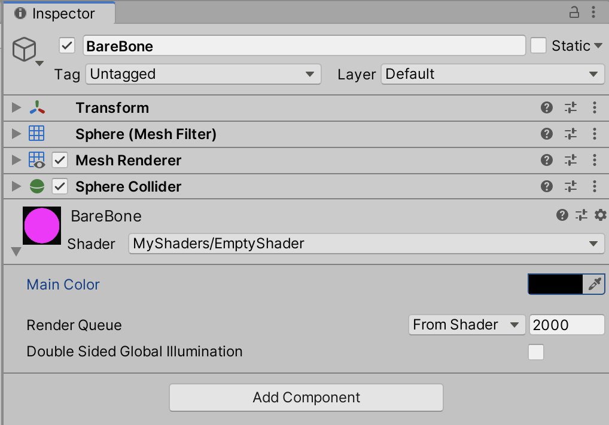
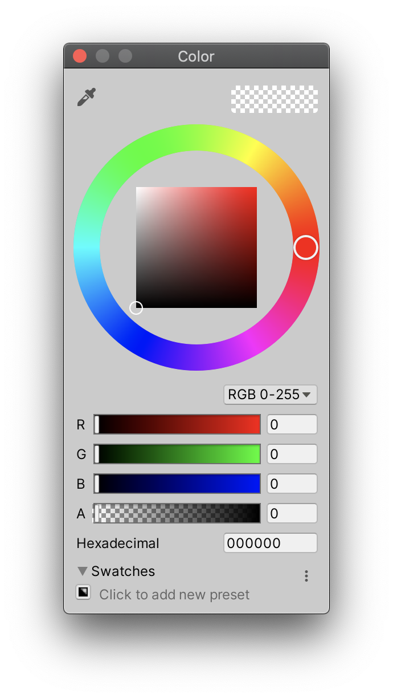
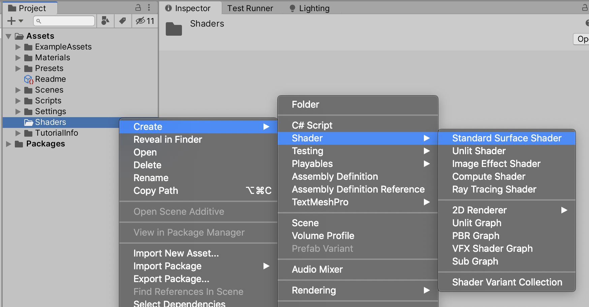

[ShaderLab으로 빈 셰이더 만들기 (1)]: https://sungkukpark.github.io/unity_bare_bone_shaderlab_shader_1/
[Properties]: https://docs.unity3d.com/Manual/SL-Properties.html
[SubShader]: https://docs.unity3d.com/Manual/SL-SubShader.html
[Pass]: https://docs.unity3d.com/Manual/SL-Pass.html
[Surface Shader]: https://docs.unity3d.com/Manual/SL-SurfaceShaders.html

[ShaderLab으로 빈 셰이더 만들기 (1)]라는 포스팅에서 우리는 유니티에서 빈 셰이더를 만들어보았다. Fallback SubShader를 지정하지 않는다고 할 때, 빈 셰이더 코드는 다음과 같이 작성할 수 있다.

```glsl
Shader "MyShaders/EmptyShader"
{
    Fallback false
}
```

위의 코드는 단순히 셰이더의 이름을 가진 빈 껍데기에 불과하다. 이제 여기에 확장 가능한 형태의 뼈대를 하나씩 세워보도록 하자.

## 프로퍼티(Properties)

셰이더는 기본적으로 **특정 시각적 표현 의도를 구현하는 코드**이기 때문에 필요에 따라 아티스트나 디자이너가 직접 셰이더를 구성하는 값을 변경할 수 있어야 한다. 이 때문에 유니티의 ShaderLab은 유니티의 머테리얼 인스펙터 창에서 여러 가지 인자(parameters)를 변경할 수 있게 지원하는 코드 정의 블록을 갖고 있다. 이를 [Properties]라 한다. 그리고 이 Properties를 구성하는 각각의 요소를 프로퍼티(Property)라고 한다. 참고로 ShaderLab에서의 Properties 구문(syntax)은 다음과 같다:

```glsl
Properties
{
    <머테리얼 프로퍼티 선언 (Material property declaration)>
    <...>
}
```

이렇게 프로퍼티를 선언하면 주어진 각각의 프로퍼티를 머터리얼 어셋(material asset)으로 저장하고, 이 머테리얼 어셋에 저장된 값을 렌더링 시에 사용하게 된다. 프로퍼티 블록은 어떤 수의 머테리얼 프로퍼티 선언이라도 포함할 수 있다.

이제 우리가 방금 만든 빈 셰이더에 Properties 블록을 정의해보자.

```glsl
Shader "MyShaders/EmptyShader"
{
    Properties
    {
    }
    Fallback false
}
```

이제 해당 Properties에 색을 표현할 컬러값을 가진 프로퍼티 하나를 추가해보자.

```glsl
Shader "MyShaders/EmptyShader"
{
    Properties
    {
        _Color ("Main Color", Color) = (1,1,1,1)
    }
    Fallback false
}
```

셰이더 파일을 저장한 뒤 유니티로 돌아가면 다음과 같이 "Main Color"라는 레이블(Label)을 가진 공개 변수 하나가 추가되었을 것이다. 그리고 해당 변수 오른쪽의 컬러 버튼을 누르면 컬러 피커(Color Picker)를 열어 원하는 색상을 할당할 수 있을 것이다.




위에서 컬러값을 가진 프로퍼티를 추가하는 문장을 하나하나 쪼개 분석해보면 다음과 같이 설명할 수 있다.

- `_Color`: 변수명 (variable name)
- `"Main Color"`: 레이블 (label)
- `Color`: 데이터 타입 (data type)
- `(1,1,1,1)`: 디폴트값 (default value)

따라서 해당 문장은 다음과 같이 해석할 수 있다:

> Color 타입의 "_Color"라는 이름의 변수를 하나 선언하고 디폴트값은 (1,1,1,1)로 한다. 그리고 이 변수를 유니티 인스펙터상에서는 "Main Color"라고 표시한다."

여기서 `(1,1,1,1)`은 RGB값이 (1,1,1)이고 알파값이 1인 컬러값이므로 해당 프로퍼티는 불투명 흰색(opaque white)을 기본 컬러값으로 가진다는 점을 알 수 있다.

## 서브셰이더(SubShader)

하지만 프로퍼티를 추가하는 것만으로는 원하는 컬러를 머터리얼에 적용하는 셰이더를 만들 수 없다. 프로퍼티는 앞에서 말한 것처럼 "유니티의 머테리얼 인스펙터 창에서 여러 가지 인자를 변경할 수 있게 지원"하는 것 자체가 목적이다. 그러니까 일종의 데이터를 선언하는 구간에 불과한 것이다. 실제 이런 데이터를 가지고 원하는 동작을 수행하기 위해서는 SubShader를 선언해줘야 한다.

유니티의 ShaderLab에서 모든 셰이더는 [SubShader]의 리스트(list)로 구성된다. 만약 유니티가 메시(mesh) 하나를 표시한다고 할 때 유니티는 어떤 셰이더를 쓸 지 검색하고 사용자의 그래픽 카드에서 구동될 수 있는 **첫 번째** 셰이더를 골라 실행할 것이다. 그러니까 일종의 순차검색을 통해 미리 정의된 SubShader 중 첫 번째 SubShader를 실행한다고 이해하면 된다. 참고로 SubShader의 구문은 다음과 같다.

```glsl
Subshader { [Tags] [CommonState] Passdef [Passdef ...] }
```

이제 우리가 만든 프로퍼티를 가진 셰이더 파일에 첫 Subshader 블록을 정의해보자.

```glsl
Shader "MyShaders/EmptyShader"
{
    Properties
    {
        _Color ("Main Color", Color) = (1,1,1,1)
    }

    SubShader
    {
        Pass
        {
        }
    }
    Fallback false
}
```

여기서 SubShader 내부의 [Pass] 블록은 유니티의 GameObject의 지오메트리(geometry)가 한번 그려지게 만드는 동작을 정의한다. 여기서 지오메트리란 GameObject의 형태, 크기, 상대적 위치, 그리고 공간의 속성의 수학적 연산에 해당한다.

우리가 작성한 Shader, Properties, SubShader, Pass 블록 모두는 유니티가 제공하는 ShaderLab 언어에 해당한다. 그러나 Pass 블록 내부에 필요한 것은 Cg 언어로서 Cg(C for Graphics)란 Nvidia에 의해 개발된 고수준 셰이딩 언어로서 vertex와 pixel 세이더를 프로그래밍하는 것이 목적인 언어이다.

그럼 이제 우리가 만든 셰이더로 돌아가서 Cg 언어가 들어갈 구간을 정의한 뒤 첫 Cg 언어를 작성하도록 한다. 여기서 Cg 언어의 구간을 정의하기 위해서는 다음과 같이 `CGPROGRAM`와 `ENDCG`라는 키워드로 언어가 들어간 공간을 지정해야 한다.

```glsl
Shader "MyShaders/EmptyShader"
{
    Properties
    {
        _Color ("Main Color", Color) = (1,1,1,1)
    }

    SubShader
    {
        Pass
        {
            CGPROGRAM
            ENDCG
        }
    }
}
```

그 다음, `CGPROGRAM`와 `ENDCG`로 정의된 Cg 언어 구간 내에 가장 단순한 형태의 버텍스 셰이더(vertex shader)와 프래그먼트 셰이더(fragment shader)를 정의하도록 한다. 여기서 버텍스 셰이더는 화면 상에서 정점을 입력받아 출력으로서 정점(vertices)의 위치를 연산하는 함수이며 프래그먼트 셰이더는 출력될 RGB 컬러값, 알파값, 그리고 Z 깊이값을 반환하는 함수이다. 이는 외우기 쉽게 "RGBAZ"라고 부르면 된다. 이때, 프래그먼트 셰이더는 픽셀 셰이더라고 부르기도 한다. 왜냐하면 DirectX에서 프래그먼트 셰이더를 픽셀 셰이더(Pixel shader)라 부르기 때문이다.

여기서 잠깐, 말이 나온 김에 서피스 셰이더([Surface Shader])가 뭔지 짚고 넘어가자면, 서피스 셰이더는 유니티가 제공하는 코드 생성(code generation) 방식으로 저수준의 버텍스/픽셀 셰이더로 작성하는 수고를 덜기 위해 더 쉬운 방식으로 셰이더 코드를 작성할 수 있게 지원해주는 세이더 함수 작성 방식이다. 만약 유니티에서 제공하는 기존 서피스 셰이더가 어떻게 작성되는지 확인하고 싶으면 다음과 같이 기본 서피스 셰이더를 생성하면 된다.



이제 다시 서피스 셰이더에 비해 저수준에 해당하는 버텍스와 프래그먼트 셰이더를 어떻게 작성하는지 확인해보기 위해 우리가 작성 중이던 셰이더 코드로 돌아오자. 설명 시간을 아끼기 위해 우선 가장 간단한 형태의 버텍스 셰이더와 프래그먼트 셰이더를 다음과 같이 완성해두었다.

```glsl
Shader "MyShaders/EmptyShader"
{
    Properties
    {
        _Color ("Main Color", Color) = (1,1,1,1)
    }

    SubShader
    {
        Pass
        {
            CGPROGRAM

            #pragma vertex vert
            #pragma fragment frag
            
            uniform half4 _Color;

            struct vertexInput
            {
                float4 vertex : POSITION;
            };

            struct vertexOutput
            {
                float4 pos : SV_POSITION;
            };

            vertexOutput vert(vertexInput v)
            {
                vertexOutput o;
                o.pos = UnityObjectToClipPos(v.vertex);
                return o;
            }

            half4 frag() : COLOR
            {
                return _Color;
            }

            ENDCG
        }
    }
}
```

위의 코드에서 새로 추가된 부분에 대한 해설은 다음 편에서 계속.
