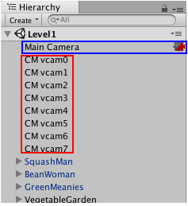
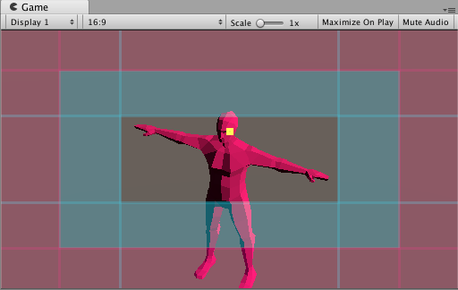

시네머신(Cinemachine)은 유니티 카메라를 동작시키고 관리하는 모듈이다. 시네머신은 카메라가 촬영 대상을 쫓고, 카메라를 블렌딩하고, 샷들을 쪼개는 복잡한 수학과 로직(logic)에 관련된 문제들을 해결한다. 시네머신은 개발 중에 엄청나게 발생하는 수동 조작이나 스크립트 변경 비용과 노력을 절감하기 위해 만들어졌다.

시네머신의 절차적인(procedural) 성질은 버그가 잘 발생하기 않게 도와준다. 예컨대, 애니메이션 자체를 바꾸거나 씬 내의 차량의 속도, 지형을 비롯한 다른 게임오브젝트(GameObject)들을 바꾸더라도 씬 내의 시네머신은 최적의 샷을 찾아 동적으로 조정된다. 예컨대, 캐릭터가 오른쪽으로 도는 대신에 왼쪽으로 돌았다고 해서 카메라 스크립트를 다시 작성할 필요가 없는 것이다.

시네머신은 FPS, 3인칭, 2D, 사이드 스크롤러(side-scroller), 탑-다운, RTS을 망라한 모든 리얼 타임 게임이나 컨텐츠에 적용된다. 시네머신은 씬에서 필요한 샷을 얼마든지 많이 제공하며 시네머신의 모듈화된 시스템은 세밀한 동작을 구현하는 것까지 지원한다.

시네머신은 타임라인(Timeline), 애니메이션, 포스트-프로세싱 어셋(post-processing assets)과 같은 유니티 도구들을 완벽하게 지원한다. 개발자는 필요에 따라 커스텀 확장이나 카메라 스크립트를 작성해 적용할 수도 있다.

## 요구 사항

시네머신은 외부 의존성이 없다. 따라서 그냥 설치해서 사용하면 된다. 단, 포스트 프로세싱 스택 버전 2(Post Processing Stack version 2)를 사용하는 경우에는 어댑터(adapter) 모듈이 함께 제공된다. 이 어댑터는 포스트 프로세싱이 프로젝트 내에서 탐지되었는지 아닌지를 판단하는 `ifdef` 지시자를 포함하는 식으로 처리가 되어있다.

현재 시네머신 버전 2.2는 다음 유니티 에디터와 호환된다:
- 최소 2017.1 이상

## 시네머신 소개

시네머신(Cinemachine)를 사용한다는 것은 카메라를 사용하는 사고 방식 자체를 바꾼다는 것이다. 만약 카메라 스크립트의 동작을 섬세하게 조작하는데 이미 엄청난 시간을 쏟아왔다면 시네머신은 같은 결과라고 하더라도 훨씬 더 짧은 시간 안에 구현할 수 있게 해준다. 그럼 당장 엔지니어의 도움 없이 카메라를 만들고 조작해보자.

## 가상 카메라(Virtual Cameras)

**시네머신은 카메라를 생성하지 않는다**. 대신 시네머신은 유니티 카메라 하나를 가지고 여러 샷을 연출해낸다. 여기서 개발자는 가상 카메라(Virtual Camera)들을 사용해 이 샷을 구현하게 된다. 가상 카메라는 유니티 카메라의 설정을 통해 움직이고 회선시키는 방식으로 작동한다.

가상 카메라는 유니티 카메라와는 완전히 별개의 게임오브젝트들이며 독립적으로 동작한다. 가상카메라는 유니티 카메라와 부모-자식 관계로 중첩되지 않는다. 예컨대, 가상 카메라를 사용하는 씬은 다음과 같이 보인다:

가상 카메라의 주요 역할은 다음과 같다:
- 씬에서 유니티 카메라의 위치를 지정한다.
- 유니티 카메라를 특정 방향으로 초점을 맞춘다.
- 유니티 카메라에 절차적인 노이즈(noise)를 준다. 노이즈는 핸드 헬드(handheld) 효과나 차량에서의 덜컹거림 등을 구현한다.

시네머신을 사용할 떄는 여러 개의 가상 카메라를 만드는 것을 권장한다. 가상 카메라는 프로세싱 파워를 거의 소비하지 않도록 설계되어 있지만, 만약 씬이 성능에 민감하다면 최고의 성능이 필요한 순간에 꼭 필요한 가상 카메라를 제외한 모든 가상 카메라를 비활성화하는 식으로 성능을 최적화할 수 있다.

경험상 가상 카메라는 샷 하나당 하나를 쓰는 것을 추천한다. 샷 하나당 가상 카메라를 하나씩만 쓰는 것은 극적이거나 미묘한 컷이나 블렌드가 필요한 다음의 경우에 도움이 된다:
- For a cutscene where two characters exchange dialog, use three Virtual Cameras: one camera for a mid-shot of both characters, and separate Virtual Cameras for a close-up of each character. Then use Timeline to synchronize audio with the Virtual Cameras.
- Duplicate an existing Virtual Camera so that both Virtual Cameras are in the same position in the Scene. For the second Virtual Camera, change the FOV or composition a bit. When a player enters a trigger volume, Cinemachine blends from the first to the second Virtual Camera to emphasize a change in action.

One Virtual Camera has control of the Unity camera at any point in time. This is the live Virtual Camera. The only exception to this rule is during a blend from one Virtual Camera to the next. During blending, both Virtual Cameras are live.

## 시네머신 브레인(Cinemachine Brain)

시네머신 브레인(Cinemachine Brain)은 유니티 카메라 자체가 가진 컴포넌트다. 시네머신 브레인은 씬 상의 모든 활성화된 가상 카메라를 감독한다. 다음 라이브 가상 카메라를 지정하려면 원하는 가상 카메라에 해당하는 게임 오브젝트를 활성화하거나 비활성화할 수 있다. 이 경우 시네머신 브레인은 가장 최근에 활성화된 가상 카메라 중에서 동일하거나 더 우선순우가 높은 가상 카메라를 다음 라이브 카메라로 지정하게 된다. 이는 이전 가상 카메라와 새롭게 지정된 가상 카메라 사이에 컷이나 블렌드 효과를 준다.

**팁**: Use Cinemachine Brain to respond to dynamic game events in real time. It allows your game logic to control the camera by manipulating priorities. This is particularly useful for live gameplay, where action isn’t always predictable. Use Timeline to choreograph cameras in predictable situations, like cutscenes. Timeline overrides the Cinemachine Brain priority system to give you precise, to-the-frame camera control.

Moving and aiming
Use the Body properties in a Virtual Camera to specify how to move it in the Scene. Use the Aim properties to specify how to rotate it.

A Virtual Camera has two targets:
- The Follow target specifies a GameObject for the Virtual Camera to move with.
- The Look At target specifies the GameObject to aim at.

Cinemachine includes a variety of procedural algorithms to control moving and aiming. Each algorithm solves a specific problem, and has properties to customize the algorithm for your specific needs. Cinemachine implements these algorithms as CinemachineComponent objects. Use the CinemachineComponent class to implement a custom moving or aiming behavior.

The Body properties offer the following procedural algorithms for moving the Virtual Camera in a Scene:

- Transposer: Move in a fixed relationship to the Follow target, with optional damping.
- Do Nothing: Do not move the Virtual Camera.
- Framing Transposer: Move in a fixed screen-space relationship to the Follow target, with optional damping.
- Orbital Transposer: Move in a variable relationship to the Follow target, optionally accepting player - input.
- Tracked Dolly: Move along a predefined path.
Hard Lock to Target: Use the same position at the Follow target.

The Aim properties offer the following procedural algorithms for rotating a Virtual Camera to face the Look At target:

- Composer: Keep the Look At target in the camera frame, with compositional constraints.
- Group Composer: Keep multiple Look At targets in the camera frame.
- Do Nothing: Do not rotate the Virtual Camera.
- POV: Rotate the Virtual Camera based on the user’s input.
- Same As Follow Target: Set the camera’s rotation to the rotation of the Follow target.
- Hard Look At: Keep the Look At target in the center of the camera frame.

## 샷 만들기

The Framing Transposer, Composer, and Group Composer algorithms define areas in the camera frame for you to compose a shot:

- Dead zone: The area of the frame that Cinemachine keeps the target in.
- Soft zone: If the target enters this region of the frame, the camera will re-orient to put it back in the dead zone. It will do this slowly or quickly, according to the time specified in the Damping settings.
- Screen: The screen position of the center of the dead zone. 0.5 is the center of the screen.
- Damping: Simulates the lag that a real camera operator introduces while operating a heavy physical camera. Damping specifies quickly or slowly the camera reacts when the target enters the soft zone while the camera tracks the target. Use small numbers to simulate a more responsive camera, rapidly moving or aiming the camera to keep the target in the dead zone. Larger numbers simulate heavier cameras, The larger the value, the more Cinemachine allows the target to enter the soft zone.

The Game Window Guides gives an interactive, visual indication of these areas. The guides appear as tinted areas in the Game view.

The clear area indicates the dead zone. The blue-tinted area indicates the soft zone. The position of the soft and dead zones indicates the screen position. The red-tinted area indicates the no pass area, which the target never enters. The yellow square indicates the target.

Adjust these areas to get a wide range of camera behaviors. To do this, drag their edges in the Game view or edit their properties in the Inspector window. For example, use larger damping values to simulate a larger, heavier camera, or enlarge the soft zone and dead zone to create an area in the middle of the camera frame that is immune to target motion. Use this feature for things like animation cycles, where you don’t want the camera to track the target if it moves just a little.

## 카메라 흔들림을 시뮬레이션하기 위한 노이즈 사용

Real-world physical cameras are often heavy and cumbersome. They are hand-held by the camera operator or mounted on unstable objects like moving vehicles. Use Noise properties to simulate these real-world qualities for cinematic effect. For example, you could add a camera shake when following a running character to immerse the player in the action.

At each frame update, Cinemachine adds noise separately from the movement of the camera to follow a target. Noise does not influence the camera’s position in future frames. This separation ensures that properties like damping behave as expected.

## 원본 문서

- [Cinemachine Documentation](https://docs.unity3d.com/Packages/com.unity.cinemachine@2.3/manual/index.html)
- [Cinemachine overview](https://docs.unity3d.com/Packages/com.unity.cinemachine@2.3/manual/CinemachineOverview.html)
