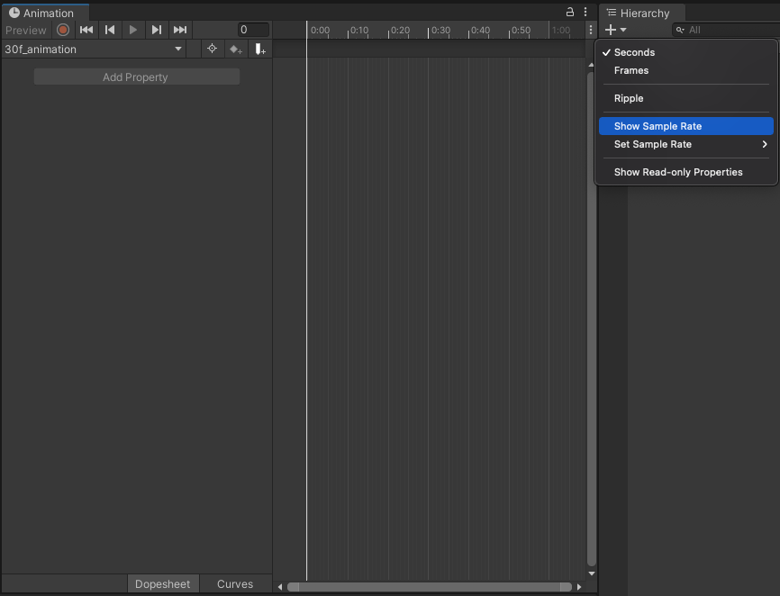
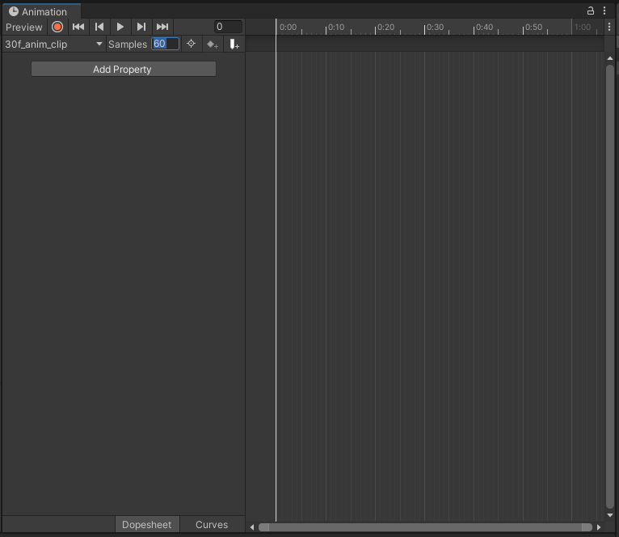
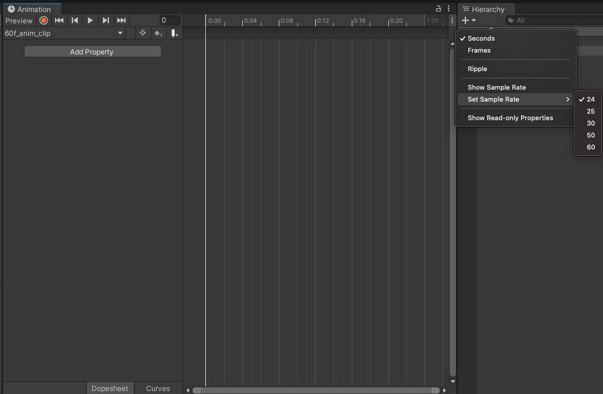
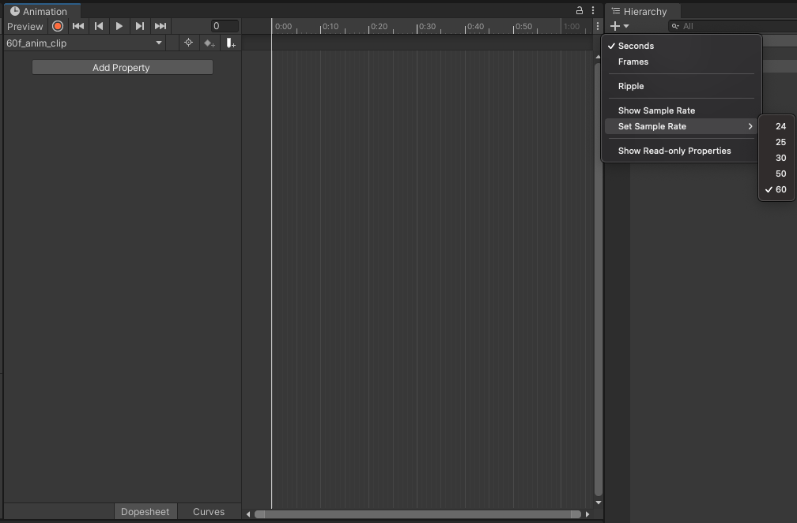

## AnimationClip.frameRate란?

[AnimationClip.frameRate]: https://docs.unity3d.com/ScriptReference/AnimationClip-frameRate.html

[AnimationClip.frameRate]는 1초당 애니메이션 키프레임(keyframes)의 개수를 표현하는 읽기 전용(Read Only) 값이다.

## 어떻게 애니메이션 샘플 프레임 레이트를 변경하는가?

애니메이션 샘플 프레임 레이트를 변경하려면 다음 두 가지 방식을 사용할 수 있다.

1. Show Sample Rate 메뉴를 통한 변경
2. Set Sample Rate 메뉴를 통한 변경

### 1. Show Sample Rate 메뉴를 통한 변경

우선, 애니메이션(Animation) 윈도우 우상단의 더보기(점 세 개) 아이콘을 눌러 "Show Sample Rate" 메뉴를 선택한다.

이후, 좌상단의 "Samples" 프로퍼티 값을 원하는 값으로 변경하면 새로운 샘플 프레임 레이트가 적용된다.

완성.

### 2. Set Sample Rate 메뉴를 통한 변경

위와 같은 식으로, 애니메이션 윈도우 우상단의 더보기(점 세 개) 아이콘을 눌러 "Set Sample Rate" 메뉴를 선택한다.

그 이후, 원하는 프레임 레이트로 샘플 프레임 레이트를 적용한다.

