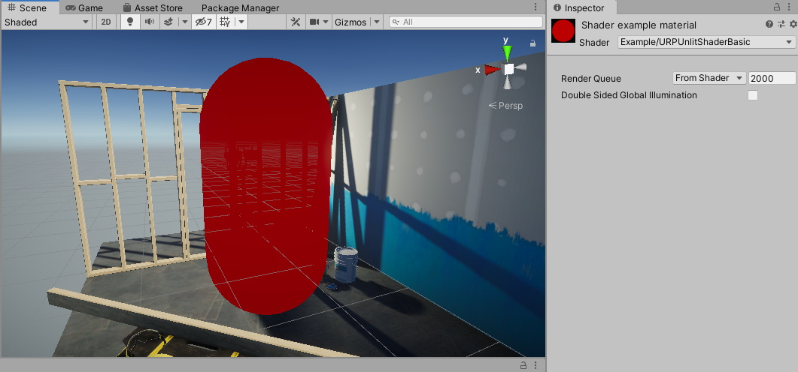
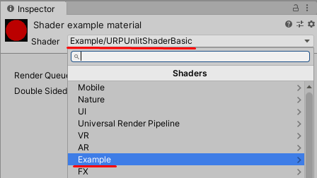

다음 예제는 기본적인 URP 호환 셰이더의 예시이다. 이 셰이더는 기본 메시 형태를 코드에 미리 지정된 컬러로 채우는 셰이더이다.

코드가 실행되는 것을 확인하려면, 다음 셰이더 랩(ShaderLab) 코드를 셰이더 어셋에 복사해 붙여넣으면 된다.

## [URP unlit basic shader 코드](https://gist.github.com/sungkukpark/5405116c379baca2da69b1230bca2ebe)

`gist:sungkukpark/5405116c379baca2da69b1230bca2ebe#urp-basic-unlit-structure_sample.shader`

이 프로그먼트 셰이더는 게임오브젝트를 어두운 빨간색 (RGB 값 (0.5, 0, 0))으로 칠한다.



다음 섹션은 이 기본 유니티 셰이더의 기본 구조를 소개한다.

## 기본 셰이더 랩(ShaderLab)[^1] 구조

유니티의 셰이더는 유니티 한정으로 쓰이는 언어인 셰이더 랩(ShaderLab)에 의해 작성된다.

본 예제의 유니티 세이더는 다음 블록들을 가지고 있다:

- [셰이더(Shader)](https://docs.unity3d.com/Packages/com.unity.render-pipelines.universal@12.0/manual/writing-shaders-urp-basic-unlit-structure.html#shader)
- [프로퍼티(Properties)](https://docs.unity3d.com/Packages/com.unity.render-pipelines.universal@12.0/manual/writing-shaders-urp-basic-unlit-structure.html#properties)
- [서브셰이더(SubShader)](https://docs.unity3d.com/Packages/com.unity.render-pipelines.universal@12.0/manual/writing-shaders-urp-basic-unlit-structure.html#subshader)
- [패스(Pass)](https://docs.unity3d.com/Packages/com.unity.render-pipelines.universal@12.0/manual/writing-shaders-urp-basic-unlit-structure.html#pass)
- [HLSLPROGRAM](https://docs.unity3d.com/Packages/com.unity.render-pipelines.universal@12.0/manual/writing-shaders-urp-basic-unlit-structure.html#hlsl)

## 셰이더 블록

셰이더 랩 코드는 다음과 같은 셰이더 선언으로 시작한다.

```hlsl
Shader "Example/URPUnlitShaderBasic"
```

이 선언의 경로는 해당 유니티 셰이더가 머테리얼의 셰이더 메뉴 상에서 표시되는 이름과 위치를 지정한다. [Shader.Find](https://docs.unity3d.com/ScriptReference/Shader.Find.html) 메서드 역시 이 경로를 사용한다.



## 프로퍼티 블록

프로퍼티 블록은 사용자가 머테리얼의 인스펙터 창을 통해 설정할 수 있는 프로퍼티들의 선언을 포함한다.

하지만 이 예제에서는 사용자가 정의할 수 있는 어떤 머테리얼 프로퍼티도 외부로 노출시키지 않으므로 프로퍼티 블록은 비어있다.

## 서브셰이더 블록

유니티 셰이더 소스 파일은 최소 하나 이상의 서브셰이더(SubShader) 블록을 포함한다. 메시를 렌더링할 때, 유니티는 타겟 기기의 GPU와 호환가능한 가장 첫 서브셰이더를 선택한다.

서브셰이더 블록은 선택적으로 서브셰이더 태그(Tags) 블록을 가질 수 있다. 서브셰이더 태그 블록을 선언하기 위해서는 `Tags` 키워드를 사용하도록 한다.

```hlsl
Tags { "RenderType" = "Opaque" "RenderPipeline" = "UniversalPipeline" }
```

`RenderPipeline` 이름과 함께 쓰인 서브셰이더 태그는 유니티에게 해당 서브셰이더가 어떤 렌더 파이프라인을 사용할지에 대해 말해주며, `UniversalPipeline`이라는 값은 유니티가 해당 서브셰이더를 URP에서 사용해야 한다는 것을 의미한다.

서로 다른 렌더 파이프라인에서 동일한 셰이더를 사용하기 위해서는, 서로 다른 `RenderPipeline` 태그 값을 가진 여러 개의 셰이더블록을 만들어야 한다. 서브셰이더 블록을 HDRP에서 실행하기 위해서는, `RenderPipeline` 태그 값을 `HDRenderPipeline`로 지정해야 한다. 해당 서브셰이더 블록을 빌트-인 렌더 파이프라인에서 실행하기 위해서는, `RenderPipeline` 태그 값을 빈 값으로 지정하면 된다.

서브셰이더 태그에 관련된 더 자세한 정보는 다음 [ShaderLab: SubShader Tags](https://docs.unity3d.com/Manual/SL-SubShaderTags.html) 문서를 참조하라.

## 패스 블록

이 예제에서, 패스 블록은 단 하나로서 HLSL 프로그램 코드를 포함한다. 패스 블록에 대한 더 자세한 정보를 참고하려면 [URP ShaderLab Pass tags](https://docs.unity3d.com/Packages/com.unity.render-pipelines.universal@12.0/manual/urp-shaders/urp-shaderlab-pass-tags.html) 문서를 참고하도록 한다.

패스 블록은 선택적으로 패스 태그 블록을 포함할 수 있다. 더 자세한 정보를 참고하려면 [URP ShaderLab Pass tags](https://docs.unity3d.com/Packages/com.unity.render-pipelines.universal@12.0/manual/urp-shaders/urp-shaderlab-pass-tags.html) 문서를 참고하도록 한다.

## HLSLPROGRAM 블록

HLSLPROGRAM 블록은 HLSL 프로그램 코드를 포함한다.

> 노트 1: HLSL 언어는 URP 셰이더에서 사용이 권장되는 언어이다.<br><br>
> 노트 2: URP는 CG 언어를 지원한다. 셰이더에 `CGPROGRAM/ENDCGPROGRAM` 블록을 추가하면, 유니티는 빌트-인 렌더 파이트라인 라이브러리를 자동적으로 포함하게 된다. SRP 셰이더 라이브러리로부터 셰이더를 포함하면, 몇몇 SRP 셰이더 메크로와 함수가 빌트-인 렌더 파이프라인 셰이더 함수와 충돌할 수도 있다. 즉, CGPROGRAM 블록은 SRP 배처와 호환되지 않는다.

HLSLPROGRAM 블록은 `Core.hlsl` 파일에 대한 래퍼런스를 포함한 `#include` 선언을 포함한다.

```hlsl
#include "Packages/com.unity.render-pipelines.universal/ShaderLibrary/Core.hlsl"
```

`Core.hlsl` 파일은 자주 사용하는 HLSL 매크로와 함수에 대한 정의 를 포함하며, `Common.hlsl`와 `SpaceTransforms.hlsl` 파일과 같은 다른 HLSL 파일에 대한 `#include` 래퍼런스를 포함한다.

예컨대, HLSL 코드에서 버텍스 셰이더는 `SpaceTransforms.hlsl` 파일에 있는 `TransformObjectToHClip` 함수를 사용한다. 이 함수는 오브젝트 스페이스에 있는 버텍스 위치를 동차 스페이스로 변환한다:

```hlsl
Varyings vert(Attributes IN)
{
    Varyings OUT;
    OUT.positionHCS = TransformObjectToHClip(IN.positionOS.xyz);
    return OUT;
}
```

다음의 기본적인 HLSL 코드에서 프로그래먼트 셰이더는 미리 지정된 컬러를 출력으로 반환한다.

```hlsl
half4 frag() : SV_Target
{
    half4 customColor;
    customColor = half4(0.5, 0, 0, 1);
    return customColor;
}
```

섹션 [URP unlit shader with color input](https://docs.unity3d.com/Packages/com.unity.render-pipelines.universal@12.0/manual/writing-shaders-urp-unlit-color.html)은 변경 가능한 컬러 프로퍼티를 머테리얼에 대한 인스펙터 윈도우에 어떻게 추가하는지 보여준다.

## 원본 문서

- [URP unlit basic shader | Universal RP | 12.0.0](https://docs.unity3d.com/Packages/com.unity.render-pipelines.universal@12.0/manual/writing-shaders-urp-basic-unlit-structure.html)

[^1]: 셰이더 랩에 대한 보다 자세한 정보는 다음 포스팅을 참고하도록 한다: [[유니티] 셰이더 랩(ShaderLab)이란?](https://sungkukpark.github.io/unity_what_is_shader_lab/)
