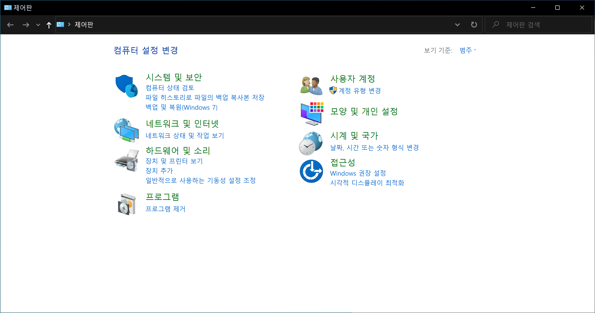
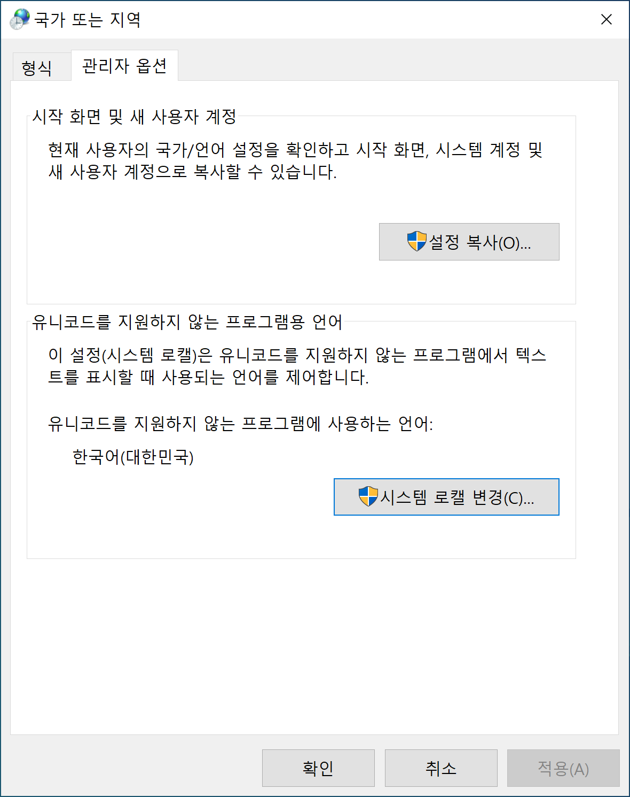
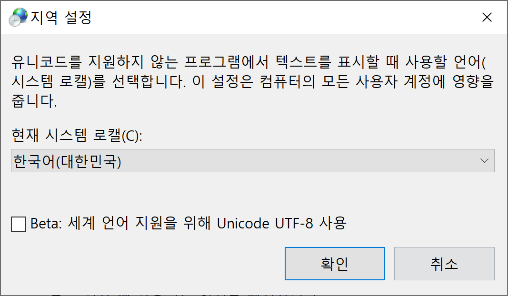

본 포스팅은 Visual Studio 2019를 사용 시, 한글로 작성된 주석이나 한글로 된 프로그램의 폰트가 깨지는 문제에 대한 해결 방법을 기술한다.

이를 해결하기 위해 "Windows 표시 언어"를 바꾸거나 Visual Studio 내부 옵션을 바꾸는 등의 시도를 했지만 여의치 않았다. 그러다 [시스템 로캘(System Locale)](https://docs.microsoft.com/en-us/windows-hardware/customize/desktop/unattend/microsoft-windows-international-core-winpe-systemlocale)이 문제였다는 사실을 발견해 이 해결 방안을 여기에 기록한다.

1. 우선, **제어판**으로 이동한다.

2. 그 다음, **날짜, 시간 또는 숫자 형식 변경**을 선택해 **국가 또는 지역** 창을 연다.

3. 마지막으로 **현재 시스템 로캘**을 **한국어(대한민국)**으로 변경한 다음 시스템을 재시작한다.

4. 문제 해결
